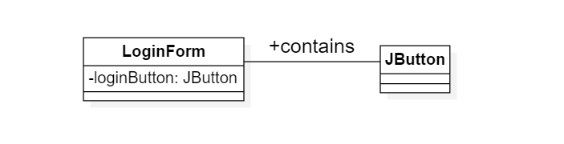
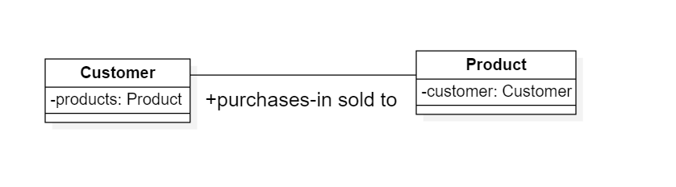
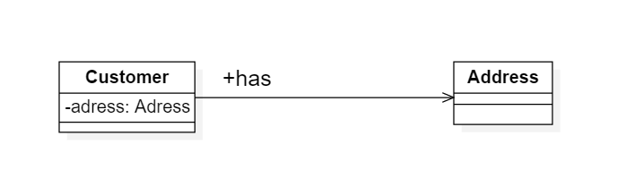
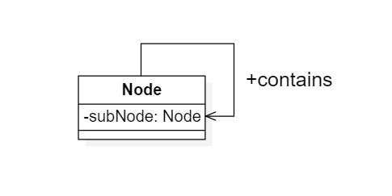
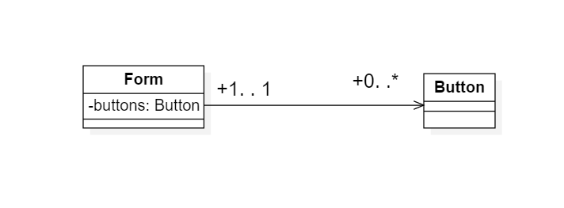
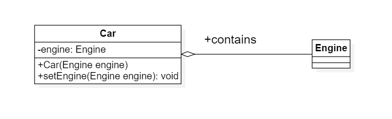
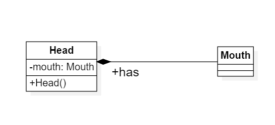
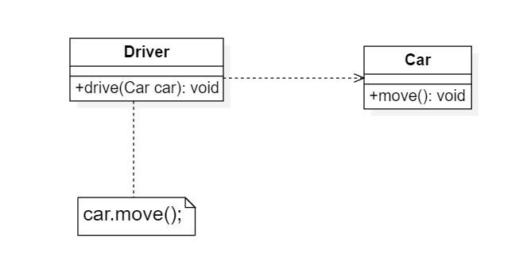
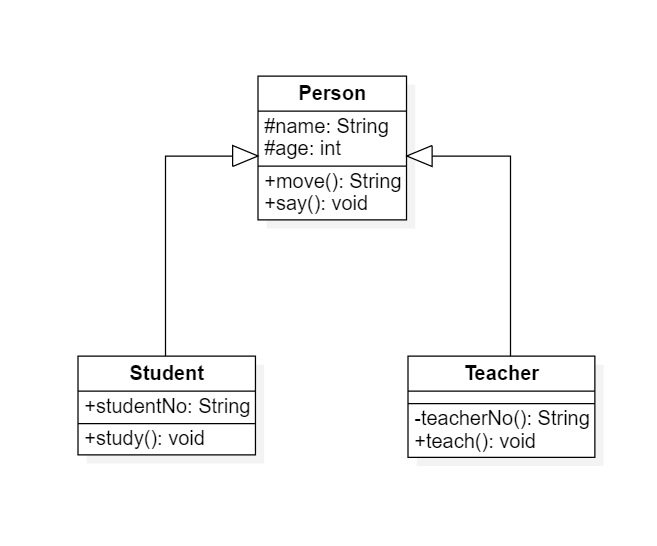
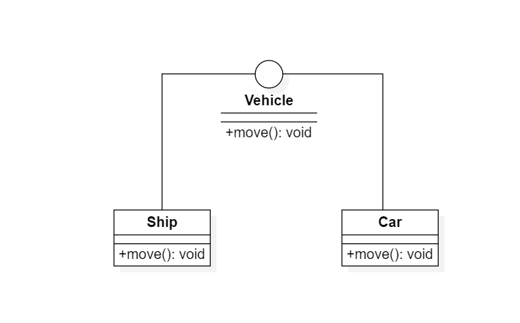

# Java设计模式

## 1. 背景

模式是在特定环境下人们解决某类重复出现问题的一套成共或者有效的解决方案

## 2. 定义

设计模式是一套反复可以使用的，多数人知晓的、经过分类编目的、代码设计经验的总结，使用设计模式是为了可重复用代码，使用设计模式是为了
可重用的代码、让代码容易被他人雷杰并且提高代码的可靠性。设计模式是一种用于软件系统中不断重现的设计模问题的解决方案进行文档化的技术

## 3. 设计基本要素

### 3.1 模式名称

模式名称通过一两个词描述模式的问题，解决方案和效果，以便更好的理解模式并方便开发人员之间的交流，绝大数模式都是根据功能或者结构来命名

### 3.2 问题

问题描述了应该在何时使用模式，它包含了设计中存在的问题以及问题存在的原因

### 3.3 解决方案

解决方案描述了设计模式的组成部分，以及这邪恶组成成分之间的相互关系，各自的职责和协作方式

### 3.4 效果

效果描述了模式应用的效果以及在使用模式时应权衡的问题

## 4. 设计模式的分类

### 4.1 根据目的分类

设计模式根据目的可分为创建型，结构型，行为型3类

1. 创建型主要用于创建对象
2. 结构型主要用于处理类或对象的组合
3. 行为型主要描述类或对象怎样交互和怎样分配职责

### 4.2 根据范围分类

设计模式根据范围（主要适用于处理类之间的关系还是处理对象之间的关系）可分为类模式和对象模式两种

1. 类模式处理和子类之间的关系，这些关系通过继承建立，在编译时就被确定下来，是一种静态关系
2. 对象模式处理对象间的关系，这些关系在运行时变划，更具动态性

## 5. 面对对象设计原则

### 5.1 简述

软件的可维护性和复用性是两个非常重要的用于衡量软件的质量，软件的可维护性是指软件能够被理解、更正、适应以及扩展的难易程度，软件的可复用性
是指软件能够被重复使用的难易程度。面对对象设计的目标之一在于支持可维护性复用，一方面需要实现设计方案或者源代码的服用，另一方面确保系统易 于扩展和修改，具有良好的可维护性

### 5.2 设计原则

1. 单一原则(SRP): 一个对象应该只包含单一的职责,并且该职责被完整地封装再一个类中
2. 开闭原则(OCP): 软件实体应当对扩展开放，对修改关闭
3. 里氏代换原则(LSP):所有引用基类的地方必须透明地使用其子类地对象
4. 依赖倒转原则(DIP): 高层模块不应该依赖底层模块，它们都应该依赖抽象。抽象不应该依赖细节，细节应该依赖抽象
5. 接口隔离原则(ISP): 客户端不应该依赖哪些它不需要的接口
6. 合成复用原则(CRP): 优先使用对象组合(类图中的关联关系(组合关系和聚合关系))，而不是通过继承来达到复用的目的
7. 迪米特法则(LoD): 每一个软件单位对其他单位都只有最少的之知识,而且局限于那些与本单位密切相关的软件单位

### 5.3 设计原则详解

## 6. 设计模式表格图

|  范围  |  创建型模式   |  结构型模式  |  行为型模式  |
|:----:|:------:|:------:|:-----:|
|  类模式  |  工厂方法模式  |   (类)适配器模式   |  解释器模式·模板方法模式   |
|  对象模式  | 抽象工厂模式·建造者模式·原型模式·单例模式  |   (对象)适配器模式·桥接模式·组合模式·装饰模式·外观模式·享元模式·代理模式   |   职责链模式·命令模式·迭代器模式·中介者模式·备忘录模式·观察者模式·状态模式·策略模式·访问者模式   |

## 7. UML类图

### 7.1 概述

UML（Unified Modeling Language，统一建模语言）是当前面向对象软件建模的标准语言，它融合了众多软件建模技术的有点，通过一系列标准的图形符号来描述系统

### 7.2 类图的表示

1. 第一部分是类名：每个类都必须有一个名字，类名是一个字符串，按照Java类名命名规范，类名通常采用帕斯卡命名法，即类名中每个单词的首字母都大写
2. 第二部分是类的属性：属性是指类的性质，即类的成员变量，一个类可以有多个属性，也可以没有属性，其UML属性定义： 【可见性】 名称 : 类型【=默认值】，可见性+号等于public，-号等于private，#号等于protected，*
   号等于包内可见
3. 第三部分是类的操作方法：【可见性】 名称(【参数列表】)  [ : 返回类型]

## 7.3 类之间的关系

### 7.3.1 关联关系

关联(Association)关系是类与类之间最常用的一种关系，它是一种结构化关系，用于表示一类对象与另一类对象之间的关系
> 登录页面LoginForm按钮包含注册JButton按钮



```
public class LoginForm {
   private JButton loginButton; // 定义为成员变量
}

public class JButton {
   ...
}
```

#### 7.3.1.1 关联关系-双向关联

默认情况下的关联关系是双向，比如顾客(Customer)购买商品(Product)并拥有商品，反之，卖出的商品总与某个顾客与之相关联。因此，Customer类与Product类之间具有双向关联关系



```
public class Customer {
   private Product[] products;
}

public class Product {
   private Customer customer;
}
```

#### 7.3.1.2 关联关系-单向关联

类的关联关系也可以是单向的，单向关联用带箭头的实线表示，例如Customer顾客拥有地址Address



```
public class Customer {
   private Address address;
}

public class Address {
   ...
}
```

#### 7.3.1.3 关联关系-自关联

在系统中会存在一些类的属性的对象类型伟该类本身，这种特殊的关联关系为自关联，例如Java中的Node节点



```
public class Node {
   private Node subNode;
}

```

#### 7.3.1.4 关联关系-多重性关联

多重性关联关系又成为重数性(Multiplicity)关联关系，表示两个关联对象在数量上的对应关系，在UML中，对象之间的多重性可以直接在关联直线上用一个数字或一个数字范围表示

| 表示方式  |             多重性说明             |
|:-----:|:-----------------------------:|
| 1. .1 |  表示另一个类的一个对象只与该类的一个对象有关系有关系   |
|0. .* | 表示另一个类的一个对象只与该类的零个或多个对象有关系有关系 |
|1. .*|表示另一个类的一个对象只与该类的一个或多个对象有关系有关系 |
|0. .1|表示另一个类的一个对象没有或只与该类的一个对象有关系有关系 |
|m. .n|表示另一个类的一个对象与该类最少m、最多n个对象有关系(m<=n) |

例如一个页面(Form)可以拥有零个或多个按钮(Button)，但是一个按钮只能属于一个页面，因此一个Form类的对象可以与零个或多个Button类的对象相关联，但一个Button类的对象只能与一个Form类的对象关联



```
public class Form {
   private Button[] button;  //定义一个集合对象
   ...
}

public class Button {
   ...
}
```

#### 7.3.1.5 关联关系-聚合关系

聚合(Aggregation)关系表示整体与部分的关系。在聚会关系中，成员对象是整体对象的一部分，但是成员对象可以脱离整体对象独立存在。在UML中，聚合关系用带空心菱形的直线表示
> 例如汽车发动机(Engine)是汽车(Car)的组成部分，但是汽车发动机可以独立存在，其关系下图所示：



```
public class Car {
   private Engine engine;
   
   //构造注入
   public Car(Engine engine){
      this.engine = engine;
   }
   
   //设值注入
   public void setEngine(Engine engine){
      this.engine = engine;
   }
   ...
}

   public class Engine {
   ...
}
```

#### 7.3.1.5 关联关系-组合关系

组合(Composition)关系也表示类之间整体和部分的关系，但是在组合关系中整体对象可以控制成员对象的生命周期，一旦整体对象不存在，成员对象也将不存在，成员对象与整体对象之间具有同生共死的关系  
在UML中，组合关系用带实心菱形的直线表示

> 例如：人的头(Head)和嘴巴(Mouth)，嘴巴是头的组成部分之一，而且如果头没了，嘴巴也就没了，因为两者是组合关系



```
  public class Head {
     private Mouth mouth;
     
     public Head() {
        mouth = new Mouth(); //实例化成员类
     }
     ...
  }
  
  public class Mouth {
     ...
  }
```

### 7.3.2 依赖关系

依赖(Dependency)关系是一种使用关系，特定事物的改变有可能会影响到使用该事物的其它事物，在需要一个事物使用另一个事物时使用依赖关系。在大多数情况下，依赖关系体现在某个类的方法使用另一个类的对象作为参数  
在UML中，依赖关系用带箭头的虚线表示，由依赖的一方指向被依赖的一方。
> 例如驾驶员开车，在Driver类的方法将Car类型对象作为一个参数传递,再调用car的move()方法，因此类Driver依赖类Car



### 7.3.3 泛化关系

泛化(Generalization)关系也就是继承关系



```
//父类
public class person {
  protected String name;
  protected int age;
  
  public void move() {
     ...
  }
  
  public void say() {
     ...
  }
}

//子类
public class Student extends Person {
   private String studentNo;
   
   public void study() {
      ...
   }
}

//子类

public class Teacher extends Person {
   private String teacherNo;
   
   public void teach() {
      ...
   }
}
```

### 7.3.4 接口与实现关系

接口在Java语言中是抽象的，只有操作的申明，没有操作的实现，在UML中，类与接口之间的实现关系用带空心三角的虚线来表示

> 例如定义一个交通工具接口Vehicle,包含一个抽象操作move()，在类Ship和类Car中都实现了该move()操作,不过具体的实现细节将会不一样



```
public interface Vehicle {
   public void move();
}

public class Ship implements Vehicle {
   public void move(){
      ...
   }
}

public class Car implements Vehicle {
   public void move(){
      ...
   }
}

```