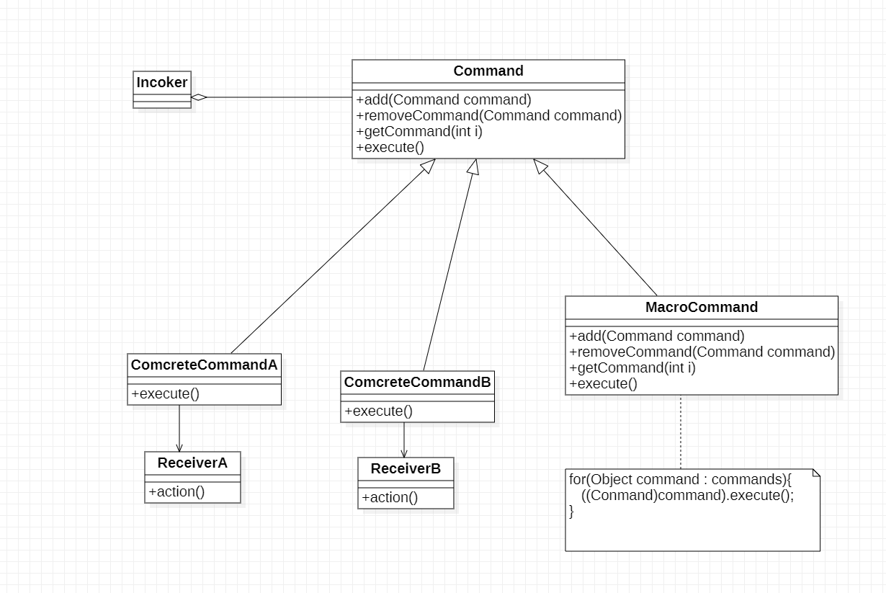

# 命令模式

## 1.命令模式含义

命令模式：将一个请求封装为一个对象，从而用不同的请求对客户进行参数化，对请求排队或者记录请求日志，以及支持可撤销的操作

## 2.命令模式类图

1. Command(抽象命令类)：抽象命令类一般是一个抽象类或接口，在其中声明了用于执行请求的execute()等方法，通过这些方法可以调用请求接收者的相关命令
2. ConcreteCommand(具体命令类)：具体命令类是抽象命令类的字类，实现了在抽象命令类中的声明的方法，它对应具体的接收者对象，将接收者对象的工作绑定其中。具体命令类在实现execute()方法时调用接收者对象的相关操作(
   Action)
3. Invoker(调用者)：调用者即请求发送者，它通过命令对象来执行请求。一个调用者并不需要在设计时确定其接收者，因此它只与抽象命令之间存在关联关系。在中序运行时可以将一个具体命令对象注入其中，在调用具体命令对象的execute()
   方法，从而实现间接调用请求接收者的相关操作
4. Receiver(接收者)：接收者执行与请求相关的操作，具体实现对请求的业务处理

## 3.命令模式实现

命令模式的本质是对请求进行封装，一个请求对应一个命令，将触发命令的责任和执行命令的责任分割开。每一个命令都是一个操作：请求的一方发出请求要求执行一个操作：
接收的一方收到请求并执行相应的操作。命令模式允许请求的一方和接收的一方独立开来，使得请求的一方不必知道接收请求的一方的接口，更不必知道请求任何被接收，操作是否被执行，何时被执行以及是怎么被执行的。
命令模式的关键在于引入了抽象命令类，请求发送者针对抽象命令类编程，只有实现了抽象命令类的具体命令才与请求接收者相关联。在最简单的抽象命令类中只包含了一个抽象的execute()
方法，每个具体命令类将一个Receiver类型的对象作为一个实例变量进行存储， 从而具体指定一个请求的接收者，不同的具体命令提供了execute()的方法不同实现

## 4.命令模式实例

> > 为了用户使用方便，某系统提供了一系列功能键，用户可以自定义功能键的功能，例如功能键FunctionButton可以用于退出系统(由SystemExitClass类来实现)，也可以用于显示帮助文档(由DisplayHelpClass类来实现)
> 用户可以通过修改配置文件改变功能键的用途，现使用命令模式设计该系统，使得功能键类与功能类之间解耦，可为同一个功能键设置不同的功能

### 4.1类图

在命令模式中每一个具体命令类对应一个请求的处理者(接收者)
，通过向请求发送者注入不同的具体命令对象可以使相同的发送者对应不同的接收者，从而实现”将一个请求封装为一个对象，用不同的请求对客户进行参数化“，客户端只需要将具体命令对象作为参数注入请求发送者，无须直接操作请求的接收者

## 5.实现命令队列

命令队列与人们常说的批处理有点类似，批处理，顾名思义，可以对一组命令对象进行批量处理，当一个发送者发送请求后将有一系列接收者对请求作出响应，命令队列可以用于设计批处理应用程序，如果请求接收者的接收次序没有严格的先后顺序，还可以用多线程技术并发调用命令对象的指定方法，从而提供程序的执行效率

## 6.命令模式的衍生：撤销操作

> > 设计一个简易的计算器，该计算器可以实现简单的数学运算，还可以对运算实时撤销操作

### 6.1类图

本例子只能实现上一步的撤销操作，没有历史状状态，可以引入一个命令集合或其它方式来存储每一次操作时命令的状态，从而实现多次撤销操作，同理也可以实现Redo即：恢复所撤销的操作(二次撤销)

## 7.宏命令

宏命令(Macro Command)又称为组合命令(Composite Command)，它是组合模式和命令模式的产物。宏命令是一个具体命令类，它拥有一个集合，在该集合中包含了对其它命令对象的引用。通常宏命令
不直接与接收者交互，而是通过它的成员来调用接收者的方法。当调用宏命令的execute()方式时将递归调用它所包含的每一个成员命令的execute()
方法，一个宏命令的成员可以是简单命令，也可以继续是宏命令。执行一个宏命令将触发多个具体命令的执行，从而实现对命令的批处理。

### 7.1宏命令类图

## 8.命令模式优缺点与适用环境

### 8.1命令模式的有点

1. 降低系统的耦合度。由于请求者与接收者之间不存在直接引用，因此请求者与接收者之间实现完全解耦，相同的请求者可以对应不同的接收者，同样相同的接收者也可以供不同的请求者调用，两者之间有良好的独立性
2. 新的命令可以很容易加到系统中。由于增加新的具体名利类不糊影响到其它类，因此增加新的具体命令类很容易，无须修改原有系统源代码，甚至客户端类代码，满足开闭原则的要求
3. 可以比较容易地设计一个命令队列或宏命令(组合命令)
4. 为请求的撤销(Undo)和恢复(Redo)操作了一种设计和实现方案

## 8.2命令模式的缺点

适用命令模式可能会导致某些系统有过多的具体命令类。因为正对每一个对请求接收者调用操作都需要设计一个具体命令类。所以在某些系统中可能需要提供大两的具体命令类，这些将影响命令模式的使用。

### 8.3命令模式的适用环境

1. 系统需要将请求调用者和请求接收者解耦，使得调用者和接收者不直接交互。请求调用者无须知道接收者的存在，也无需知道接收者是谁，接收者也无须关心何时被调用
2. 系统需要在不同时间指定请求，将请求排队和执行请求。一个命令对象和请求的初始调用者可以有不同的生命期，换而言之，最初的请求调用者可能已经不在了，而命令对象本身依然活动的，可以通过该命令对象去调用请求接收者
   ，并且无须关心请求调用者的存在性，可以通过请求日志文件等机制来具体实现
3. 系统需要支持命令的撤销(Undo)操作和恢复(Redo)操作
4. 系统需要将一组操作组合在一起形成宏命令
