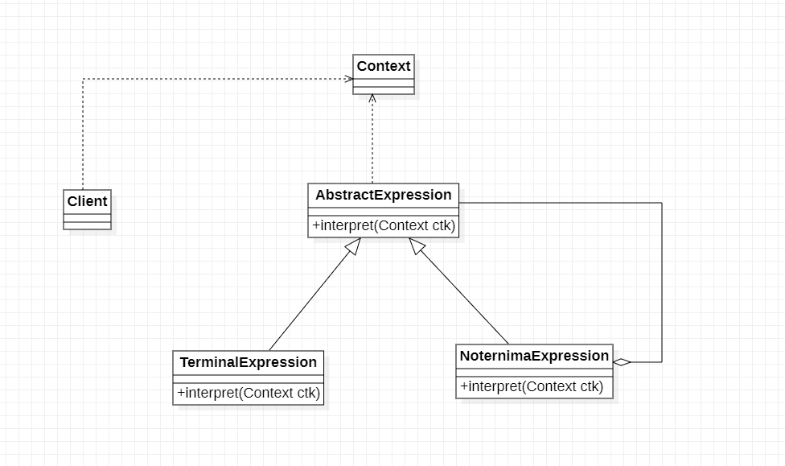

# 解释器模式

## 1.解释器描述

解释器模式：给定一个语言，定义它的文法的一种表示，并定义一个解释器，这个解释器使用来解释语言中的句子，解释器模式定义所指的“语言”是使用规定格式和语法的代码，解释器模式是一种行为型模式

## 2.文法规则和抽象语法树

解释器模式描述了如何为简单的语言定义一个文法，如何在该语言中表示一个句子，以及如何解释这些句子。在正式分析解释器模式结构之间先来学习如何表示一个语言文法规则以及如何构造一颗抽象语法树

```
experssion :: = value | operation 
operation :: = expression '+' experssion | expression '-' expression
value :: = an integer // 一个数组
```

## 3.解释器模式结构

## 3.1 类图



1. AbstractExpression(抽象表达式): 在抽象表达式中声明了抽象的解释操作，它是所有终结符表达式和非终结符表达式的公共父类
2. TerminalExpression(终结符表达式): 终结符表达式是抽象表达式的子类，它实现一与文法中的终结符相关联的解释操作，在句子中每一个终结符都是该类的一个实例。
通常在一个解释器模式中只有少数几个终结符表达式类，它们的实例可以通过非终结符表达式组成复杂的句子
3. NonterminalExpression(非终结符表达式)：非中介表达式也是抽象表达式的子类，它实现了文芳中非中介符的解释操作，由于在非终结符表达式中可以包含终结符表达式，也可以继续包含非终结符表达式，因此其解释操作一般通过递归的方式完成
4. Context(环境类): 环境类又称为上下文类，它用于存储解释器之外一些全局信息，通常它临时存储了需要解释的语句