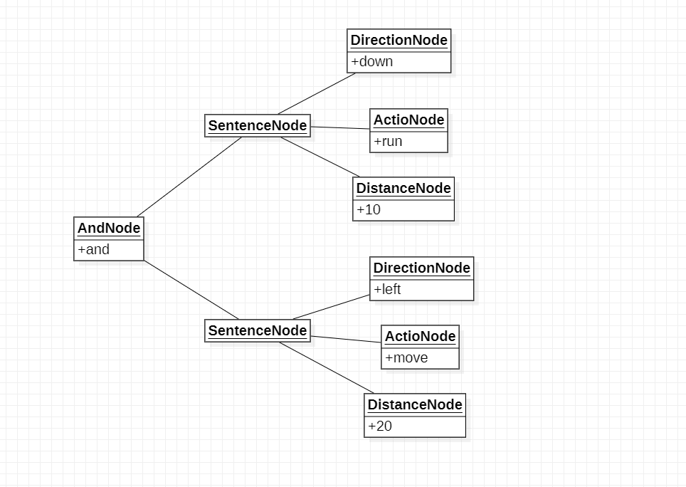
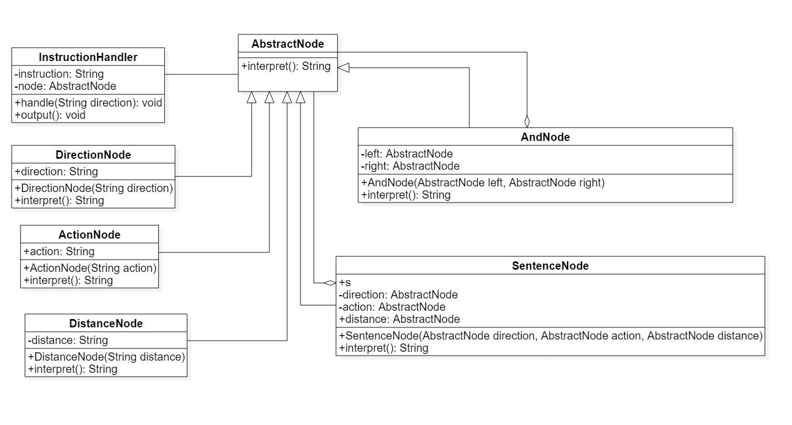

# 解释器模式

## 1.解释器描述

解释器模式：给定一个语言，定义它的文法的一种表示，并定义一个解释器，这个解释器使用来解释语言中的句子，解释器模式定义所指的“语言”是使用规定格式和语法的代码，解释器模式是一种行为型模式

## 2.文法规则和抽象语法树

解释器模式描述了如何为简单的语言定义一个文法，如何在该语言中表示一个句子，以及如何解释这些句子。在正式分析解释器模式结构之间先来学习如何表示一个语言文法规则以及如何构造一颗抽象语法树

```
experssion :: = value | operation 
operation :: = expression '+' experssion | expression '-' expression
value :: = an integer // 一个数组
```

## 3.解释器模式结构

## 3.1 类图


1. AbstractExpression(抽象表达式): 在抽象表达式中声明了抽象解释操作，它是所有终结符表达式和非终结符表达式的公共父类
2. TerminalExpression(终结符表达式): 终结符表达式是抽象表达式的子类，它实现一与文法中的终结符相关联的解释操作，在句子中每一个终结符都是该类的一个实例。
   通常在一个解释器模式中只有少数几个终结符表达式类，它们的实例可以通过非终结符表达式组成复杂的句子
3. NonterminalExpression(非终结符表达式)
   ：非中介表达式也是抽象表达式的子类，它实现了文芳中非中介符的解释操作，由于在非终结符表达式中可以包含终结符表达式，也可以继续包含非终结符表达式，因此其解释操作一般通过递归的方式完成
4. Context(环境类): 环境类又称为上下文类，它用于存储解释器之外一些全局信息，通常它临时存储了需要解释的语句

## 4.解释器实例

### 4.1 实例

> > 某软件公司要开发一套机器人控制程序，在该机器人控制程序中包含一些简单的英文控制指令，每一个指定可以对应一个表达式（expression），该变道时可以是简单表达式也可以是复合表达式， 每一个简单表达式由移动方向(direction)，移动方式(action)和移动距离(distance)3部分组成，其中移动方向包括上(up),下（down），左（left），右（right）;移动方向包括移动（move）和快速移动（run）；移动距离为一个正整数。两个表达式之间可以通过与（and）连接星成复合（composite）表达式 用户通过对图形化的设置页面进行操作可以创建一个机器人控制指令，机器人在收到指令后将按照指令的设置进行移动，例如输入控制指令“up move 5”，则向上移动5个单位；输入控制指令“down run 10 and left move 20”，则向下快速移动10个单位再向左移动20个单位，现用解释器模式来设计该程序并模拟实现

```
1. expression :: = direction action distance | composite //表达式
2. composite :: = expression 'and' expression //复合表达式
3. direction :: = 'up' | 'down' | 'left' | 'right' //移动方向
4. action :: = 'move' | 'run' //移动方式
5. distance :: = an inreger //移动距离

该语言一共定义了5条语法规则，对应5个语言单位，这些语言单位可以分为两类，一类为终结符（也可以称为终结符表达式），例如direction,action和distance，它们是语言的最小组成单位，不能再进行拆分；另一类为非终结符（也可以称为非终结符表达式）
例如：expression和composite，它们都是一个完整的句子
```

### 4.2 对象图



### 4.3 类图



## 5.解释器优缺点与适用环境

样例：XML解析，Eclipse AST Java源码抽象语法树

### 5.1 解释器优点

1. 易于改变和扩展文法。由于在解释器模式中使用类表示语言的文法规则，因此可以通过继承等机制来改变或扩展文法
2. 每一条文法规则都可以表示为一个类，因此可以方便地实现一个简单的语言。
3. 实现文法较为容易，在抽象语法树中每一个表达式结点类的实现方式都是相似的，这些类的代码编写都不会特别复杂，还可以通过一些工具自动生成结点类代码
4. 增加新的解释表达式较为方便。如果用户要增加新的解释表达式只需要对应增加一个新的终结符表达式或非终结符表达式类，原有表达式类代码无须修改，符合开闭原则

### 5.2 解释器缺点

1. 对于复杂文法难以维护。在解释器模式中每一条规则至少需要顶一个一个类，因此如果一个语言包含太多语法规则，类的个人则会急剧增加，导致系统难以管理和维护，此时可以考虑使用语法分析程序等方式来取代解释器模式
2. 执行效率较低。由于在解释器模式中使用了大量循环和递归调用，因此在解释较为复杂的句子时其速度很慢，而且代码的调试过程也比较麻烦

### 5.3 解释器适用环境

1. 可以将一个需要解释执行的语言中的句子表示为一颗抽象语法树
2. 一些重复出现的问题可以用一种简单的语言进行表达
3. 一个语言的文法较为简单。对于复杂的文法，解释器模式中的文法类层次结构变得很庞大而无法管理，此时最好使用语法分析程序生成器
4. 执行效率不是关键问题。高效的解释器通常不是通过直接解释抽象语法树来实现的，而是需要将他们转换成其它形式，使用解释器模式执行效率并不高

