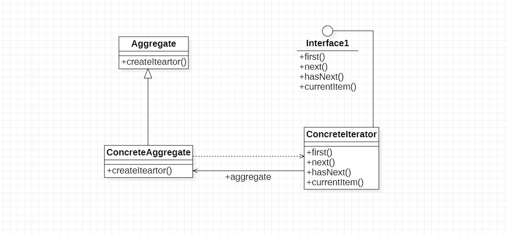
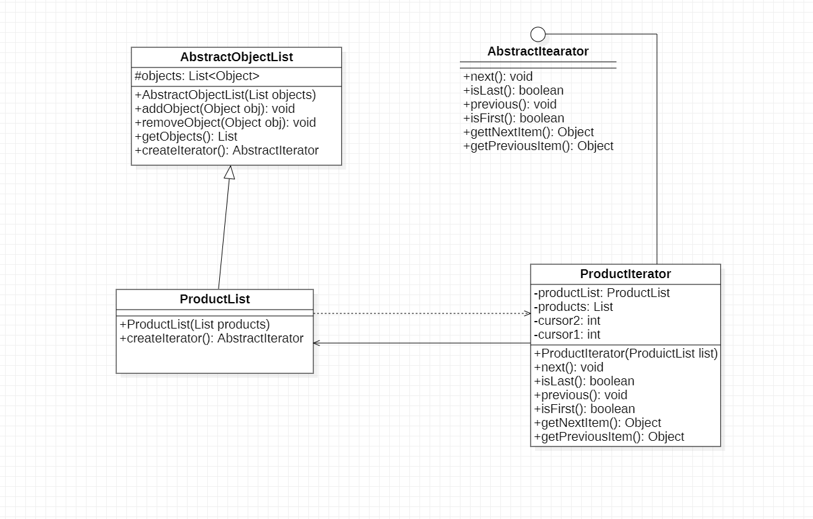

# 迭代器模式

## 1.定义

迭代器模式：提供一种方法顺序访问一个聚合对象中的各个元素，而不用暴漏对该对象的内部表示，迭代器又称游标(Cursor)模式，它是一种对象行为型模式

## 2.结构



1. Iterator(抽象迭代器)：它定义了访问和遍历元素的接口，声明了用于遍历的数据元素的方法，例如获取第一个元素的first()方法，用于访问下一个元素的next()方法 用于判断是否还有下一个元素的hasNext()
   方法，用于获取当前元素的currentItem()方法等，在具体迭代器中将实现这些方法
2. ConcreteIterator(具体迭代器)：它实现了抽象迭代器接口，完成对聚会对象的遍历，同时在具体迭代器中通过游标来记录在聚合对象中所处的当前位置，在具体实现游标通常是一个表示位置的非负整数
3. Aggregate(抽象聚合类)：它用于存储和管理元素对象，声明一个createIterator()方法用于创建一个迭代器对象，充当抽象迭代器工厂角色
4. ConcreteAggregate(具体聚合类)：它是抽象聚合类的子类，实现了抽下个聚合类中声明的createIterator()方法，该方法返回一个与该具体聚合类对应的具体迭代器ConcreteIterator()实例

## 3. 实例

> > 某软件公司为某商场开发了一套销售管理系统，在对该系统进行分析和设计时，开发人员发现经常需要对系统种的商品数据，客户数据等进行遍历，为了复用这些遍历代码，开发人员设计了一个抽象的数据集合类AbstractObjectList,而将有存储商品和客户等数据的类作为其子类，开发人员设计了一个抽象的数据集合类AbstractObjectList的结构如下所示：

AbstractObjectList函数说明

|         方法名          |        方法说明         |
|:--------------------:|:-------------------:|
| AbstractObjectList() | 构造方法，用于给objects对象复制 |
|     addObject()      |        增加元素         |
|    removeObject()    |        删除元素         |
|      getObjects      |       获取所有元素        |
|        next()        |       移至下一个元素       |
|       isLast()       |   判断当前元素是否为最后一个元素   |
|      previous()      |       移至上一个元素       |
|      isFirst()       |   判断当前元素是否为第一个元素    |
|    getNexiItem()     |       获取下一个元素       |
|   getPreviousItem    |       获取上一个元素       |

```
  AbstractObjectList类的子类ProductList和CustomerList分别用于存储商品数据和客户数据。通过分析发现AbstractObjectList类的职责非常重，它既负责存储和管理数据，又负责遍历数据，违反了单一职责原则，实现代码将非常复杂。
  因此开发人员决定使用迭代器模式对AbstractObjectList类进行重构，将负责遍历数据的方法提取出来封装到专门的类中，实现数据存储和数据遍历分离，还可以给不同的具体集合类提供不同的遍历方法。现给出使用迭代器模式重构后的解决方案。
```

### 3.1 实例类图



## 4. 迭代器模式优缺点与适用环境

迭代器模式是一种使用频率非常高的设计模式，通过引入迭代器可以将数据的遍历功能从聚会对象中分离出来，聚合对象只负责存储数据，而遍历数据由迭代器来完成。
由于多编程的语言库都已经实现了迭代器模式，因此在实际开发中只需要直接使用Java,C+等语言定义好的迭代器即可，迭代器已经称为操作聚合对象的基本工具之一。

### 4.1 迭代器模式优点

1. 迭代器模式支持以不同的方式遍历一个聚合对象，在同一个聚合对象上可以定义多种遍历方式。在迭代器模式中只需要用一个不同的迭代器替换原有迭代器即可改变遍历算法，也可以自己定义迭代器的子类以支持新的遍历设计
2. 迭代器模式简化了聚合类，由于引入了迭代器，在原有的聚会对象中不需要再自行提供数据遍历等方法，这样可以简化聚合类的设计
3. 在迭代器模式中由于引入了抽象层，增加新的聚合类和迭代器类都很方便，无须修改原有的代码，满足开闭原则

### 4.2 迭代器模式缺点

1. 由于迭代器模式将在存储数据和遍历数据职责分离，在增加新的聚合类时需要对应增加新的迭代器类，类的个数成对增加，在这一定程序上增加了系统的复杂性
2. 抽象迭代器的设计难度较大，需要充分考虑到系统将来的扩展，在自定义迭代器时创建一个考虑全面的抽象迭代器并不是一个很容易的事情

### 4.3 迭代器模式适用环境

1. 访问一个聚会对象的内容而无需暴漏它的内部表示。将聚合对象的访问与内部数据的存储分离，时得访问聚合对象时无须了解其内部实现细节
2. 需要为一个聚合对象提供多种遍历方式
3. 为遍历不同的聚合结构提供一个统一的接口，在该接口的实现类中为不同的聚合结构提供不同的遍历方式，而客户端可以一致性地操作该接口


