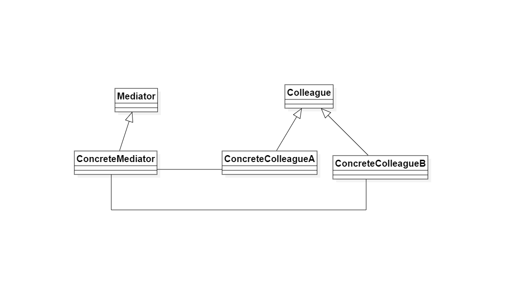

# 中介者模式

## 1. 定义

中介者模式：定义一个对象来封装一系列对象的交互。中介者模式使各对象之间不需要显式地相互引用，从而时其偶和松散，而且用户可以独立地改变它们之间地交互

## 2. 中介者模式思想

### 2.1 类图

1. Mediator（抽象中介者）：它定义一个接口，该接口用于与各同事对象之间进行通信
2. ConcreteMediator(具体中介者)：它是抽象中介者的子类，通过协调各个同事对象来实现协作行为，它维持了对各个同事对象的引用
3. Colleague（抽象同事类）：它定义各个同事类公有的方法，并声明了一些抽象方法供子类实现，同时它维持了一个对抽象中介者类的引用，其子类可以通过该引用与中介者通信
4. ConcreteColleague（具体同事类）：它是抽象同事类的子类，每一个同事对象在需要和其他同事通信时先与中介者同行，通过中介者剑完成与其它同事类的通信，在具体同事类中实现了在抽象同事类中声明的抽象方法

## 3. 中介者模式实现

### 3.1 中介者模式的职责

1. 中专作用（行为性）：通过中介者提供的中转作用，各个同事对象不再需要显示地引用其它同事，当需要和其他同事进行通信时可以通过中介者实现间接调用。该中转左右属于中介者在结构上的支持
2. 协调作用（行为性）：中介者可以更进一步地对同事之间的关系进行封装，同事可以一致地和中介者进行交互，而不需要指明中介者需要具体怎么做，中介者根据封装在自身内部地协调逻辑对同事的请求进行进一步处理，将同事成员之间的关系行为进行分离和封装

