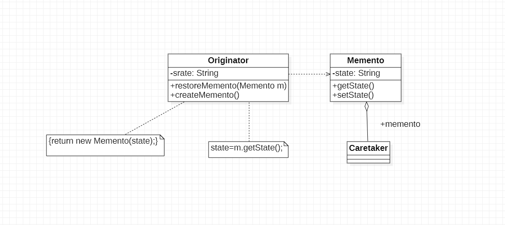

# 备忘录模式

## 1. 定义

备忘录模式：在不破坏封装的前提下捕获一个对象的内部状态，并在该对象之外保存这个状态，这样可以在以后讲对象恢复到原先保存的状态

## 2. 类图

1. Originator(原发器)：原发器是一个普通类，它通过创建一个备忘录来存储当前内部状态，也可以使用备忘录来恢复其内部状态，一般讲系统需要保存内部状态的类设计为原发器
2. Memento(备忘录)：备忘录用于存储原发器的内部状态，根据原发器来决定保存哪写内部状态。备忘录的设计一般可以参与原发器的设计，根据实际需要确定备忘录类中的属性。
   需要注意的是，除了原发器本身与负责人类之外，备忘录对象不能直接提供其他类使用，原发器的设计在不同的编程语言中实现机制有所不同
3. Caretaker(负责人)：负责人又称为管理者，它负责保存备忘录，但是不能对备忘录的内容进行操作或检查。在负责人类中可以存储一个或多个备忘录对象，它只负责存储对象，而不能修改对象，也无需知道对象的实现细节

