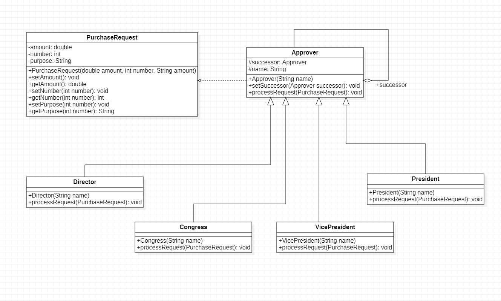

# 职责链模式概述

## 1.行为型模式含义

行为型模式分为类行为型设计模式和对象设计模式两种，其中类行为型模式使用继承关系在这几个类之间分配行为，主要通过多态等方式来分配父类与子类的职责；
而对象行为型模式则使用对象的关联关系来分配行为，主要通过对象关联等方式来分配两个或多个类的职责。根据合成复用原则，在系统中复用功能时要尽量使用关联关系来取到继承关系，因为大部门行为型设计模式大多数都为对象行为型设计模式。

## 2.职责链模式含义

职责链可以是一条直线，一个环或者一个树形结构，最常见的职责链是直线型，即沿着一条单向的链来传递请求。链上的每一个对象都是请求处理者，职责链模式可以将请求的处理者组织成一条链，并让请求沿着链传递，由链上的每一个对象都是请求者进行相应的处理，客户端无须关心请求的细节以及请求的传递，只需讲请求发送到链上即可，
将请求处理者解耦，职责链与责任链相同，它是一种对象行为型模式。

## 3.职责链模式结构

### 3.1 职责链结构类图

1. Handler(抽象处理者)
   ：它定义了一个处理请求的接口，一般设计为抽象类，由于不同的具体处理者处理请求的方式不同，因此在其中定义了抽象请求处理方法。每一个处理者的下家还是一个处理者，故在抽象处理者中定义了一个抽象处理者类型的对象作为其对下家的引用，通过该引用处理者可以连城一条链
2. ConcreteHandler(具体处理者)
   ：它是抽象处理者的字类，可以处理用户请求，在具体处理类中实现了抽象处理者定义的抽象请求处理方法，在请求处理之前需要进行判断，看是否具有相应的处理权限，如果可以处理请求就处理它，否则讲请求转发给后继者，在具体处理者中可以访问链中的下一个对象，以便请求的转发

## 4.职责链模式应用实例

> > 某企业的SCM供应链管理系统中包含一个采购审批子系统。该企业的采购审批是分级进行的，即根据采购金额的由不同层次的主管人员来审批，主任可以审批5万元以下(不包括5万元)的采购单，
> 副董事长可以是审批五万元至10万元的(不包括10万元)的采购单，董事长可以审批10万元至50万元(不包括50万元)的采购单，50万元及以上的采购单则需要开董事会讨论决定
> 采购人员--->主任--->副董事长--->董事长--->董事会

### 4.1 实例类图

## 5.纯与不纯的职责链模式

### 5.1 纯的职责链模式

一个纯的职责链模式要求一个具体处理者对象只能在两个行为中选择一个，要么承担全部责任，要么责任推给下家，不允许出现某一个具体处理者对象在承担了一部门或全部责任后又将责任向下传递的情况。
而且在纯的责任链模式中要求一个请求必须被某一个处理者对象所接收，不能出现某一请求未被任何一个处理者对象处理的情况。4.1的例子是纯的职责链模式

### 5.2 不纯的职责链模式

在一个不纯的职责链模式中允许某个请求被一个具体处理者部门处理后再向下传递，或者一个具体处理者处理完某请求后其后处理者可以继续处理该请求，而且一个请求可以最终不被任何处理者对象所接收并处理

## 6.职责链优缺点和适用环境

职责链模式通过建立一条链来组织请求的处理者，请求讲沿着链进行传递，请求发送者无须知道请求在何时，何处以及如何被处理，实现了发送者与处理者的解耦。在软件开发中，如果遇到多个对象可以处理同一请求可以应用职责链模式，
例如：在Web应用开发中创建多个过滤器(Filter)链来对请求数据进行过滤，在工作流系统中实现公文的分级审批等，使用职责链模式可以很好地解决此类问题。Java语言中地异常处理(Exception Handlers)
级之也是职责链模式的典型应用之一， 不同的catch子句可以处理不同类型的异常，这些catch子句构成了一条处理异常对象的职责链

### 6.1 职责链优点

1. 职责链模式时得一个对象无须知道是其他哪一个对象处理请求者，对象仅需知道该请求会被处理即可，接收者和发送者都没有对方的明确信息，并且链中的对象不需要知道链的结构，由客户端负责链的创建，降低了系统的耦合度
2. 请求处理对象仅需一个指向其后后继者的引用，而不需要维持它对所有候选处理者的引用，可简化对象之间的相互连接
3. 在给对象分派职责时，职责链可以带来更多的灵活性，可以通过在运行时对该链进行动态的增加或修改来增加或改变处理一个请求的职责
4. 在系统中增加一个新的具体请求处理者时无须膝盖原有系统的代码，只需要在客户端重新构建链杰克，从这一点看来是符合开闭原则的

### 6.2 职责链缺点

1. 由于一个请求没有明确的接收者，那么就不能保证它一定会被处理，该请求可以一致到链的末端都得不到处理，一个请求也可能因职责链没有正确配置而得不到处理
2. 对于比较长的职责链，请求的处理可能涉及多个处理对象，系统性能将受到一定的影响，而且在进行代码调试时不太方便
3. 如果建链不当，可能会造成循环调用，将导致系统陷入死循环

### 6.3 职责链适用环境

1. 有多个对象可以处理同一个请求，具体哪一个对象处理该请求待运行时刻再确定，客户端只需将请求提交到链上，而无须关系请求的处理对象是谁以及它是如何处理的
2. 在不明确指定接收者的情况下向多个对象中的一个提交一个请求
3. 可动态指定一组队长的处理请求，客户端可以动态创建职责链来处理请求者，还可以改变链中处理者的先后顺序

