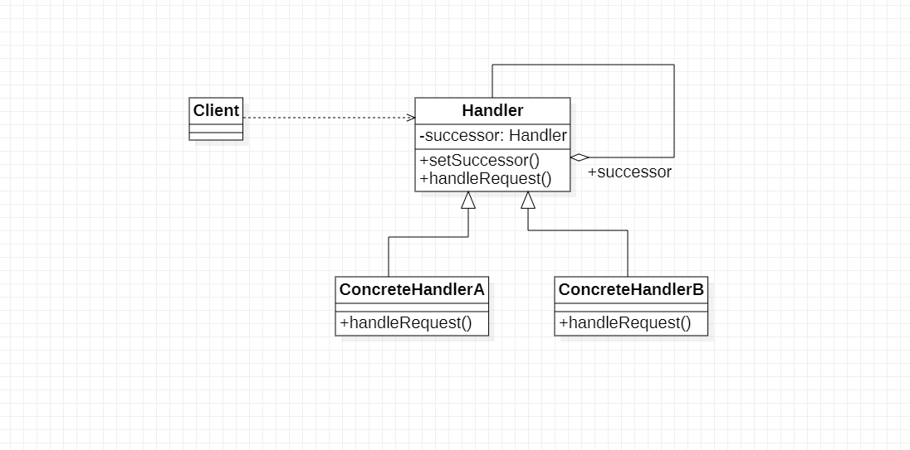

# 职责链模式概述

## 1.行为型模式含义

行为型模式分为类行为型设计模式和对象设计模式两种，其中类行为型模式使用继承关系在这几个类之间分配行为，主要通过多态等方式来分配父类与子类的职责；
而对象行为型模式则使用对象的关联关系来分配行为，主要通过对象关联等方式来分配两个或多个类的职责。根据合成复用原则，在系统中复用功能时要尽量使用关联关系来取到继承关系，因为大部门行为型设计模式大多数都为对象行为型设计模式。

## 2.职责链模式含义

职责链可以是一条直线，一个环或者一个树形结构，最常见的职责链是直线型，即沿着一条单向的链来传递请求。链上的每一个对象都是请求处理者，职责链模式可以将请求的处理者组织成一条链，并让请求沿着链传递，由链上的每一个对象都是请求者进行相应的处理，客户端无须关心请求的细节以及请求的传递，只需讲请求发送到链上即可，
将请求处理者解耦，职责链与责任链相同，它是一种对象行为型模式。

## 3.职责链模式结构

### 3.1 职责链结构类图

1. Handler(抽象处理者)
   ：它定义了一个处理请求的接口，一般设计为抽象类，由于不同的具体处理者处理请求的方式不同，因此在其中定义了抽象请求处理方法。每一个处理者的下家还是一个处理者，故在抽象处理者中定义了一个抽象处理者类型的对象作为其对下家的引用，通过该引用处理者可以连城一条链
2. ConcreteHandler(具体处理者)
   ：它是抽象处理者的字类，可以处理用户请求，在具体处理类中实现了抽象处理者定义的抽象请求处理方法，在请求处理之前需要进行判断，看是否具有相应的处理权限，如果可以处理请求就处理它，否则讲请求转发给后继者，在具体处理者中可以访问链中的下一个对象，以便请求的转发

