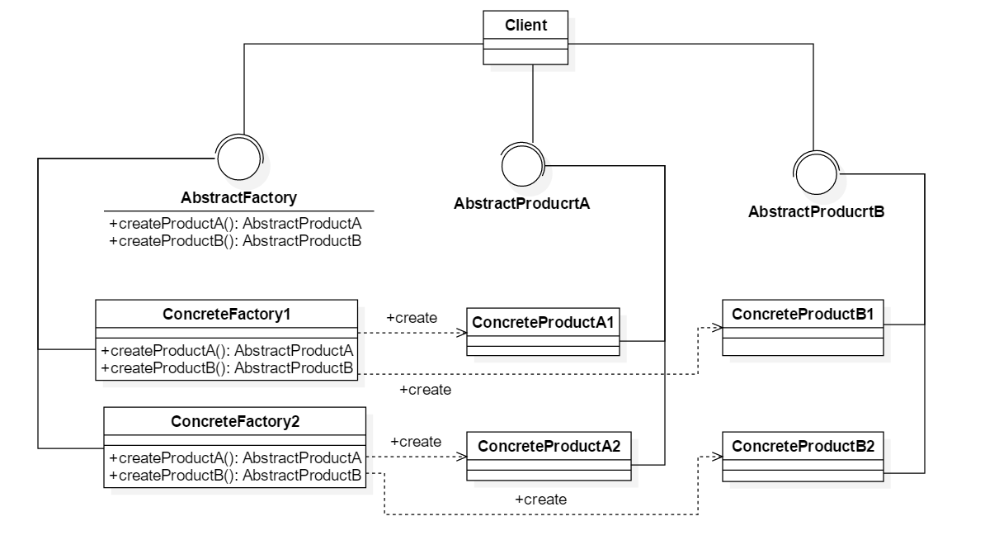
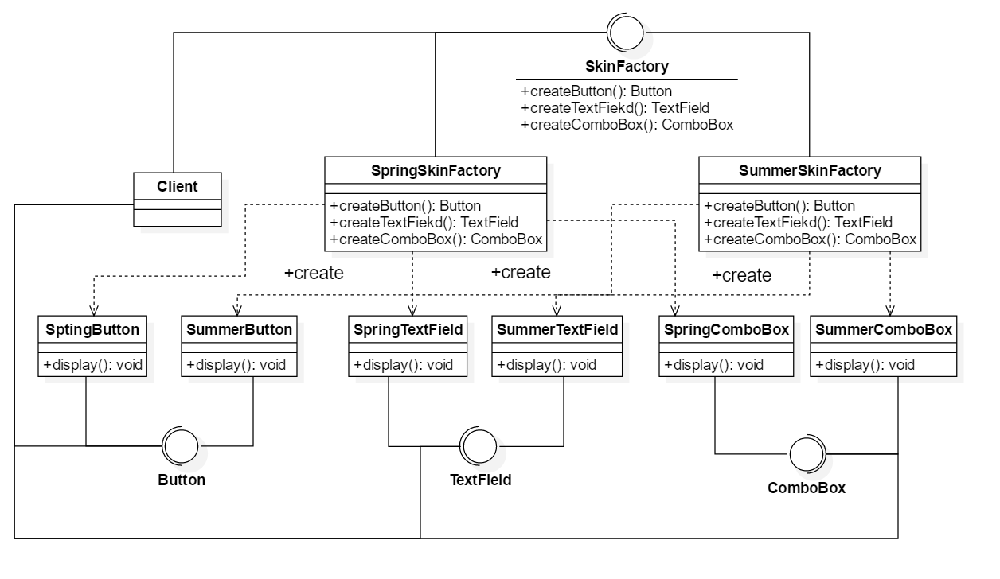

# 抽象工厂模式

## 1. 定义

提供一个创建一系列相关或相互依赖对象的接口，而无须指定它们具体的类，抽象工厂模式又称为工具Kit模式，它是一种对象创建型模式

## 2. 解析

抽象工厂模式是常用的创建型设计模式之一，它比工厂方法模式的抽象程度更高。在工厂方法模式中每一个具体工厂只需要生产一种具体产品，但是在抽象工厂模式中一个具体工厂可以生产一组相关的具体产品，这样的一组产品成微产品族，产品族中的每一个产品都分属于某一个产品继承等级结构

## 3. 新概念与论述

### 3.1 新概念

* 产品等级结构：继承结构即一个纵向抽象父类，其有许多被继承的子类
* 产品族：横向的继承抽象父类

### 3.2 论述

当前系统所提供的工厂生产的具体产品并不是一个简单的对象，而是多个位于不同产品等级结构、属于不同类型的具体产品时就可以使用抽象工厂模式。抽象工厂模式是所有形式的工厂模式中最为抽象和最具一般性的一种形式。
抽象工厂模式与工厂方法模式最大的区别在于，一个工厂等级接口可以负责多个不同产品等级结构中的产品对象的创建。当一个工厂等级结构可以创建出分属于不同产品等级结构中一个产品族中得所有对象时，抽象工厂方法模式比工厂方法模式更为简单， 更有效率

## 4. 抽象工厂模式结构

### 4.1 结构

1. AbstractFactory（抽象工厂）：它声明了一组用于创建一组产品的方法，每一个方法对应一种产品。
2. ConcreteFactory（具体工厂）：它实现了在抽象工厂中申明的创建产品的方法，生成一组具体产品，这些产品构成了一个产品族，每一个产品都位于某个产品等级结构中。
3. AbstractProduct（抽象产品）：它为每种产品声明接口，在抽象产品中声明了产品所具有的业务方法。
4. ConcreteProduct（具体产品）：它定义具体工厂生产的具体产品对象，实现抽象产品接口中声明的业务方法。

### 4.2 类图

1. AbstractFactory(抽象工厂): 它声明了一组用于创建一族产品的方法，每一个方法对应一种产品
2. ConcreteFactory(具体工厂): 它实现了在抽象工厂中声明的创建产品的方法，生成一组具体产品，这些构成了一个产品族，每一个产品都位于某个产品等级结构中
3. AbstractProduct(抽象产品): 它为每种产品声明接口，在抽象产品中声明了产品所具有的业务方法
4. ConcreteProduct(具体产品): 它定义具体工厂生成的具体产品对象，实现抽象产品接口中声明的业务方法

## 5. 例子

> 某软件公司要开发一套界面皮肤库，可以对基于Java的桌面软件进行界面优化。用户在使用可以通过菜单选择皮肤，不同的皮肤将提供视觉效果不同的按钮、
> 文本框、组合框等界面元素，例如春天风格的皮肤将提供浅绿色的按钮，绿色边框文本框和绿色边框的组合框，而夏天的风格的皮肤则提供浅蓝色的按钮、蓝色边框的文本框和兰色边框的组合框。
> 该皮肤库需要具备良好的灵活性和可扩展性，用户可以自由选择不同的皮肤，开发人员可以在不修改既有代码的基础上增加新的皮肤

其类图：  

## 6. 抽象工厂模式的开闭原则的倾斜性

根据标题5的例子可以看出，如果在一整套皮肤中再加入单选按钮组件，则需要对抽象SkinFactory和及其具体工厂类修改源码，但是这样会导致开闭原则被破坏。
因为抽象工厂模式无法解决此类问题所在，也是比较大的缺点，但是在抽象方法增加产品族则很方便，直接增加对应的具体工厂类即可。

## 7. 适用环境及其优缺点

JDK包下的AWT(抽象窗口工具包)中就使用了抽象工厂模式，这个模式也是高频设计模式之一

### 7.1 优点

1. 抽象工厂模式隔离了具体类的生产，使得客户端并不需要知道什么被创建。由于这种隔离，更换一个具体工厂就变成相对容易，所有的具体工厂都实现了抽象工厂中定义的 那些公共接口，因此只需要改变具体工厂的实例就可以在某种成都上改变整个软件系统的行为
2. 当一个产品族中的多个对象被设计成一起工作时，它能够保证客户端始终只使用同一个产品族中的对象
3. 增加新的产品族很方便，无须修改已有的系统，符合开闭原则

### 7.2 缺点

1.增加新的产品等级结构麻烦，需要对原有系统进行较大的修改，甚至需要修改抽象层代码，这显然会带来较大的不便，违背了开闭原则

### 7.3 适用环境

1. 一个系统不应该依赖于产品类如何被创建，组合和表达的细节，这对于所有类型的工厂模式都是很重要的，用户无须关心对象的创建过程，将对象的创建和使用解耦
2. 系统中有多余一个产品族，每次只是用一个产品族，可以通过配置文件等方式改变产品族，也可以方便地使用新的产品族
3. 约束一个共同的约束条件，产品等级结构稳定，在设计完成不频繁对系统增加新的产品等级结构或者删除已有的产品等级结构