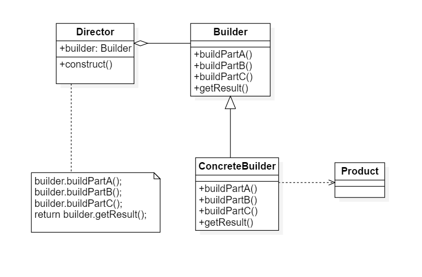
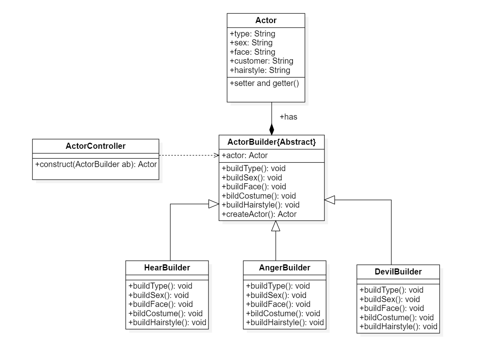

# 建造者模式

## 1. 定义

建造者模式：将一个复杂对象的构建与它的表示分离，使得同样的构建过程可以创建不同的表示

## 2. 类图



1. Builder(抽象建造者)：它为创建一个产品对象的各个部件执行抽象接口，定义许多复杂对象的各个部件，Builder既可以是抽象类也可以是接口
2. ConcreteBuilder（具体建造者）：实现了Builder接口，实现各个部件的具体构造和装配方法，定义并明确所创建的复杂对象，还可以提供一个方法返回创建好的复杂产品对象（该方法也可以由抽象建造者实现）
3. Product（产品）：它是被构建的对象，包含多个组成部件，具体建造者创建该产品内部的表示并定义它的装配过程
4. Director（指挥者）：指挥者又称为导演类，它负责安排复杂对象的建造次序，指挥者与抽象建造者之间存在关联关系，可以在其construct（）建造方法中调用建造者对象的部件构造与适配方法完成
   复杂对象的构造。客户端一般和指挥者进心交互，也可以通过配置文件和反射机制实现

## 3. 建造者模式应用实例

```
    某游戏软件公司开发一款基于角色扮演的多人在线网络游戏，玩家可以在游戏中板件虚拟世界中的一个特定角色，角色根据不同的游戏剧情和统计数据（例如力量、魔法、技能等）具有不同的能力，角色也会随着不断升级而拥有更加强大的能力。

    作为改游戏的一个重要组成部分，需要对游戏角色进行设计，而且随着不断升级而拥有更加强大的能力。作为该游戏的一个重要组成部分，需要对游戏角色进行设计，而且随着该游戏的升级将不断增加薪得角色。
通过分析发现，游戏角色是一个复杂对象，它包含性别，脸型等多个组成部分，不同类新那个的游戏角色，其性别、脸型、服装和发型等多个组成部分，不同类型的游戏有美丽的面容和披肩的常罚，并身穿一袭白裙；而恶魔极其丑陋，留着光头并穿衣间刺眼的黑衣 

    无论是何种造型的游戏角色，它的创建都大同小异，都需要逐步创建其组成部分，再将各组成部分装备成一个完整的游戏角色
```

### 3.1 类图



### 3.2 优化指挥者

1. 如果需要省略指挥者，则可以直接对抽象建造者直接进行合并，直接增加静态方法即可，但是加重了抽象类的职责，若是建造复杂，则还是封装到单一类，符合单一职责原则
2. 钩子方法，利用在抽象基类中构造一个返回方值为true/false的方法进行是否进行建造，以及对建造的顺序变动

## 4. 建造者的优点

1. 在建造者模式中，客户端不必知道产品内部组成的细节，将产品本身与产品的创建解耦，使得相同的创建过程可以创建不同的产品对象
2. 每一个建造者都相对读力，而其他的具体建造者无关，因此可以方便地替换具体建造者或者增加新的具体建造者，用户使用不同地具体建造者可以得到不同 地产品对象。对指挥类进行变成，增加新的具体建造者，符合开闭原则
3. 可以更加精细地控制产品的创建过程，将复杂的产品的创建步骤分解在不同的方法中，使得创建过程更加清晰，也更加方便使用程序来控制创建过程

## 5. 建造和的缺点

1. 产品的属性差异大，不是属于同一类的产品，就不适用建造者模式
2. 产品内部的变化复杂，需要定义很多具体建造者的也不适用这种模式

## 6. 建造者适用环境

1. 需要生成的产品对象有复杂的内部结构，这些产品对象通常包括多个成员变量
2. 需要生成的产品 对象的属性相互依赖，需要指定其生成顺序
3. 对象的创建过程独立于创建该对象的类，在建造者模式中通过引入指挥者类创建过程封装在指挥者类中。而不在建造者类和客户类中
4. 隔离复杂对象的创建和适用，并使得相同的创建过程可以创建不同的产品


