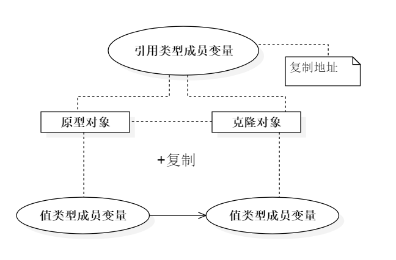
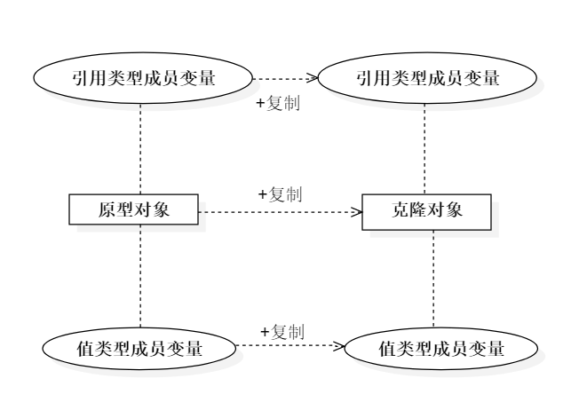
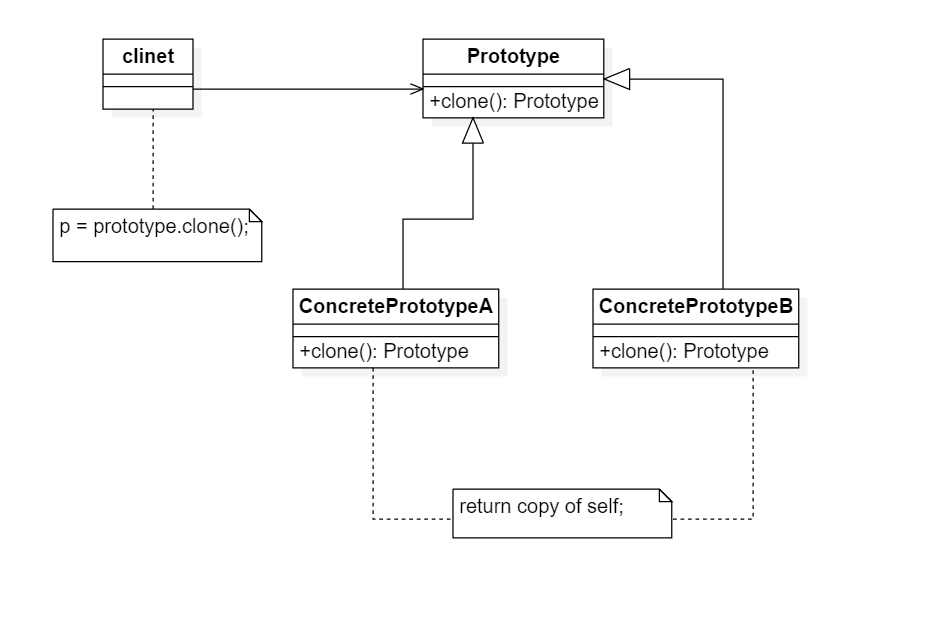
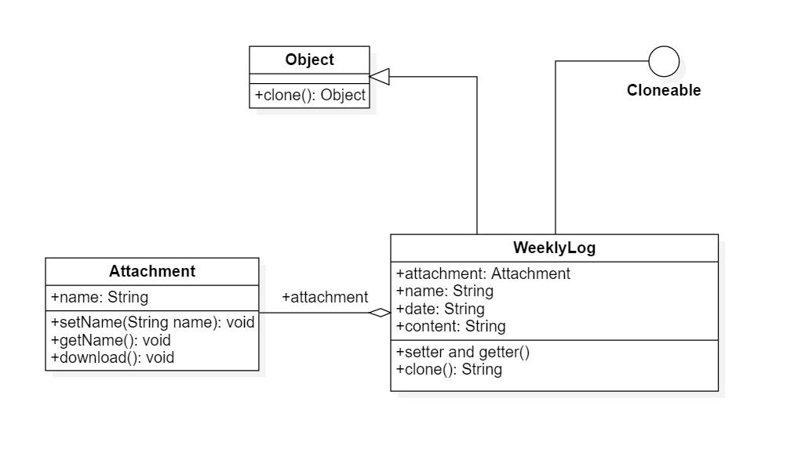
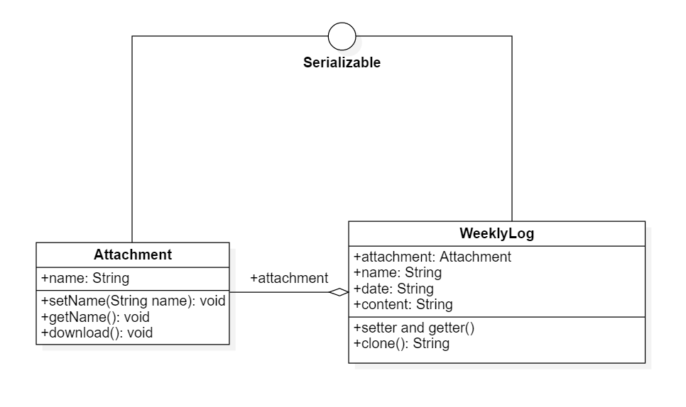
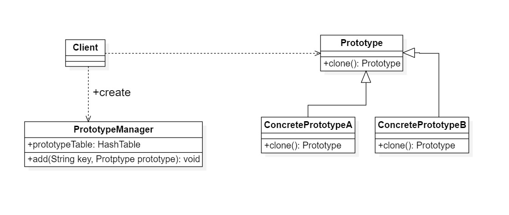

# 原型模式

## 1. 定义

原型模式：使用原型实例指定待创建对象的类型，并且通过复制这个原来创建新的对象

## 2. 浅克隆与深克隆

### 2.1 区别

根据在复制对象的同时是否扶着包含在原型对象中引用类型的成员变量，原型模式的克隆机制分为两种，即浅克隆与深克隆

### 2.2 浅克隆 (Shallow Clone)

在浅克隆中，如果原型对象的成员变量是值类型（如int，doouble，byte，boolean，char等基本数据类型），将复制一份给克隆对象；如果原型对象的成员变量是引用类型（如类，接口，数组等复杂数据类型），
则将引用对象的地址复制一份给克隆对象，也就是说原型对象和克隆对象的成员变量指向相同的内存地址。简单来说，在浅克隆中，当原型对象被复制时只复制它本身和其中包含的值类型的成员变量，而引用类型的成员变量并没有复制，如下图所示：

### 2.3 深克隆 (Deep Clone)

在深克隆中，无论原型对象的成员变量是值类型还是引用类型，都将复制一份给克隆对象，深克隆对象的所有引用对象也复制一份给克隆对象。简单来说，在深克隆中，除了对象本身被复制外，对象所包含的成员变量也将被复制

### 2.4 原型模式的类图与实现

1. Prototype(抽象原型类)：它是什么克隆方法的接口，是所有具体圆形类的公共父类，它可以是抽象类也可以是接口，甚至还可以是是具体实现类
2. ConcretePrototype(具体原型类)：它实现在抽象原型类中申明的克隆方法，在克隆方法中返回自己的一个克隆对象
3. Client(客户类)：可以根据选择需要具体的原型类，系统具有良好的扩展性，增加或者更换具体原型类都很方便

### 2.5 Java语言中的Cloneable接口

1. 对任何对象x，都用x.clone() != x，即克隆对象与原型对象不是一个对象
2. 对任何对象x，都有x.clone().getClass() == x.getClass，即克隆对象与原型对象的类型一样
3. 如果对象x的equals()方法定义恰当，那么x.clone().equals(x)应该成立

为了获取对象的一个克隆，可以直接利用Object的clone方法，具体步骤如下：

1. 在派生类中覆盖基类的clone()方法，并声明为public
2. 在派生类的clone()方法中调用super.clone()
3. 派生类需实现Cloneable接口

此时，Object类相当于抽象原型类，所有实现了Cloneable接口的类相当于原型类

## 3. 原型模式应用实例

> 在使用OA的时候，大家 迫切希望有一种机制能够快速创建相同或者相似的周报，包括创建周报的附件

### 3.1 浅克隆的类图

由prototypePattern下的shallow包下的结果可知：  
周报是否相同：false 附件是否相同：true  
不符合要求对附件对象进行克隆

### 3.2 深克隆类图

由prototypePattern下的deep包下的结果可知：  
周报是否相同：false 附件是否相同：false

序列化就是把对象写入流的过程，然后再反序列化把对象取出

## 4. 原型管理器

### 4.1 含义

原型管理器(Prototype Manager)将多个原型对象存储在一个集合中供客户使用，它是专门负责克隆对象的工厂，其中定义了一个结合用于存储原型对象，如果需要某个原型对象的一个克隆，可以通过复制集合中对应的原型对象来获得，
在原型管理器中针对抽象圆形类进行编程，以便扩展

### 4.2 类图

## 5. 原型模式的优缺点以及适用环境

### 5.1 优点

1. 当创建新对象较为复杂时，使用原型对象可以简化对象的创建过程，通过复制一个已有的实例可以提高实例的创建效率
2. 扩展性好，由于在原型模式中提供了抽象原型类(Object)，在客户端可以针对抽象原型类编程，而将具体原型类写在配置文件中，增加或减少产品类对原有系统没有任何影响
3. 原型模式提供了简化的创建结构，工厂方法模式常常需要有一个与产品类等级结构相同工厂等级结构，而原型模式就不需要这样，原型模式中产品的复制是通过封装在原型类中的克隆方法实现的，无须专门的工厂类来创建产品
4. 可以使用深克隆的方式保存对象的状态，使用原型模式将对象复制一份并将其状态保存起来，以便在需要的时候使用(例如恢复到某一个历史状态)，可辅助实现撤销操作

### 5.2 缺点

1. 需要为每一个类配备一个克隆方法，而且该克隆方法位于一个类的内部，当对已有的类进行改造时需要修改源代码，违背了开闭原则
2. 在实现深克隆时需要编写较为复杂的代码，而且当对象之间存在多重的嵌套引用时，为了实现深克隆，每一层对象对应的类都必须支持深克隆，实现起来可能会比较麻烦

### 5.3 适用环境

1. 创建新对象成本较大(例如初始化需要占用较长时间，占用太多的CPU资源或网络资源)，新对象可以通过复制已有对象来获得，如果相似对象，则可以对其成员变量稍作修改
2. 系统保存对象的状态，而对象的状态变化很小
3. 需要避免适用分层次的工厂类来创建分层次的对象，并且类的实例对象只有一个或很少的几个组合状态，通过复制原型对象得到新实例可能比使用构造函数创建一个新实例更加方便

