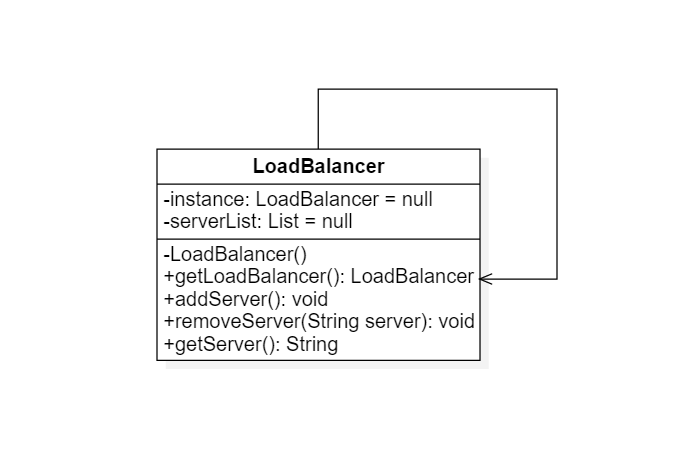

# 单例模式

## 1. 定义

单例模式：确保一个类只有一个 实例，并提供一个全局访问点来访问这个唯一实例

### 1.1 要点

1. 某个类只能有一个实例
2. 他必须自行创建这个实例
3. 它必须自行向整个系统提供这个实例

## 2. 单例模式结构与类图

### 2.1 类图


### 2.2 注意事项

1. 单例构造函数的可见性为private
2. 提供一个类型为自身的静态私有成员变量
3. 提供一个共有的静态方法工厂

## 3. 单例模式例子应用

> 某软件公司承接了一个服务器负载均衡(Load Balance)软件的开发功能工作，该软件运行在一台负载均衡服务器上，可以将并发访问和数据流量分发到服务器集群中堕胎设备上进行并发处理，提高系统的整体处理能力，缩短响应时间。
> 由于集群中的服务器需要动态删减，且客户请求需要统一分发，因此需要确保负载均衡器的唯一性，只能有一个负载均衡器负责服务器的管理与请求分发，否则将会带来服务器状态的不一致以及请求分配冲突等问题。

### 3.1 类图



## 4. 饿汉式单例

### 4.1 饿汉单例类图


## 5. 懒汉加载单例与双重检查锁定

### 5.1 懒汉加载类图

> 与饿汉单例类相同的是，懒汉单例类的构造函数也是私有的，与饿汉单例类不同的是，懒汉单例类在第一次被引用时将自己实例化


### 5.2 双重检查锁定

```
        if (instance == null) {
            synchronized (LazySingletonSynchronizedTwice.class) {
                if (instance == null) {
                    instance = new LazySingletonSynchronizedTwice();
                }
            }
        }
```

### 5.3 饿汉单例模式与懒汉单例模式的区别与比较

1. 饿汉单例模式在类被初始化的时就将自己实例化，它的优点在于被多线程调用可以确保实例唯一性
2. 从调用速度和反应时间角色来讲，由于单例对象一开始就得以创建，因此要优于懒汉单例
3. 从资源利用效率来说，饿汉单例模式不及懒汉单例模式，但是由于加载系统初期徐耀创建饿汉单例模式，加载时间可能会比较长

### 5.3 IoDH静态内部类实现单例模式

```
public class Singleton {

    private Singleton(){

    }

    public static class HolderClass{
        private final static  Singleton instance = new Singleton();
    }

    public static Singleton getInstance(){
        return HolderClass.instance;
    }

    public static void main(String[] args) {
        Singleton s1,s2;
        s1 = Singleton.getInstance();
        s2 = Singleton.getInstance();
        System.out.println(s1 == s2);
    }
}
```

## 6. 单例模式的优缺点以及适用环境

### 6.1 优点

1. 单例模式提供了对唯一实例的受控防访问，因为单例类封装了它的唯一实例，还严格控制客户怎样以及何时访问它
2. 由于在系统内部中存在一个对象，因此可以节约系统资源，对于一些徐耀频繁创建和销毁的对象，单例模式无疑是可以提供下同的性能
3. 允许可变的数目的实例。由于单例模式可以进行扩展，使用与控制单例对象的相似方法来获得指定个数的实例对象，既节省系统资源，又解决单例对象共享过多有损性能的问题（注意：自行提供指定数目实例对象的类可称为多例类）

### 6.2 缺点

1. 由于单例模式没有抽象层，因此单例类的扩展有很大的困难
2. 单例类的职业过重，在一定的程度上违背了单一职责原则。因为单例类既提供了业务方法，又提供了创建对象的方法（工厂方法），将对象的创建和对象本身的功能偶和在一起
3. 现在很多面向对象语言的运行环境都提供了自动垃圾回收技术，会自动销毁并回收资源，下次利用时又将重新实例化，这将导致共享的单例对象状态的丢失

### 6.3 适用环境

1. 系统只需要一个实例对象，例如系统要求提供一个唯一的序列号生成器或资源管理器，或者因为资源消耗太大而只允许创建一个对象
2. 客户调用类的单个实例只允许使用一个公共访问点，除了该公共访问点，不能通过其它途径访问该实例


