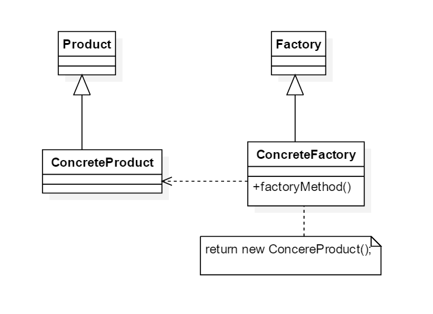
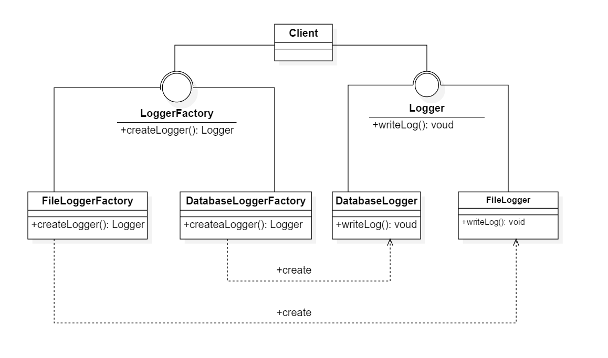

# 工厂方法模式

## 1. 定义

定义一个用户创建对象的接口，但是让字类决定将哪一个类实例化，工厂方法模式让一个类的实例化延迟到其字类

## 2. 解析

工厂方法模式是简单工厂模式的延伸，它继承了简单工厂模式的有点，同时还弥补了简单工厂模式的缺陷，更好地符合开闭原则的要求，在新增新的具体产品对象时不需要对已经系统做任何修改



1. 抽象产品Product：它是定义产品的接口，是工厂方法模式所创建对象的超类型，也就是产品对象的公共父类
2. 具体产品ConcreteProduct：它实现了抽象产品的接口，某种类型的具体产品由专门的具体工厂创建，具体工厂和具体产品之间一一对应
3. 抽象工厂Factory：在抽象工厂类中声明了工厂方法，用于一个产品。抽象工厂是工厂方法模式的核心，所有创建对象的工厂类都必须实现接口
4. 具体工厂ConcreteFactory：它是抽象工厂类的字类，实现了在抽象工厂中声明的工厂方法，并可由客户端调用，反汇一个具体产品类的实例

## 3. 反射机制与配置文件

### 3.1 Java反射机制

Java反射是在程序运行时获取已知名称的类或已有的对象的相关信息的一种机制，包括类的方法、属性、父类等信息，还包括实例的创建和
实例类型的判断等。Class类是反射用的最多的类，Class类的实例表示正在运行Java应用程序中的类和接口，其forName（String className）
方法可以返回与带有给定字符串名的类或接口相关联的Class对象，再通过Class对象的newInstance()方法创建此对象所表示类的一个新实例

```
Class c = Class.forName("java.lang.String");
Object obj = c.newInstance;
return obj;
```

### 3.2 配置文件

软件系统的配置文件通常为XML文件，可以使用DOM（Document Object Model）、SAX（Simple API for XML）、StAx（Streaming API for XML）
等技术来处理XML文件。在开发中可以把类名存储到XML配置文件中，再读取配置文件获取类名字符串，然后通过Java反射机制来创建对象

```
<?xml version="1.0"?>
<config>
    <className>whc.design.pattern.creational.type.factoryMethod.example.FileLoggerFactory</className>
</config>
```

### 3.3 反射解析配置文件类

```
import javax.xml.parsers.DocumentBuilder;
import javax.xml.parsers.DocumentBuilderFactory;
import java.io.File;

public class LoggerFactoryXMLlUtil {
    //该方法用于从XML配置文件中提取具体表的类名，并返回一个实例对象
    public static Object getBean() {
        try {
            //创建DOM文档对象
            DocumentBuilderFactory documentBuilderFactory = DocumentBuilderFactory.newInstance();
            DocumentBuilder builder = documentBuilderFactory.newDocumentBuilder();
            Document doc;
            doc = builder.parse(new File("src//whc.design.pattern.creational//factoryMethodPattern//factoryMethodExample//LoggerFactory.xml"));

            //获取包含类名的文本节点
            NodeList nodeList = doc.getElementsByTagName("className");
            Node classNode = nodeList.item(0).getFirstChild();
            String cName = classNode.getNodeValue().trim();

            //通过类名生成实例对象并将其返回
            Class c = Class.forName(cName);
            Object obj = c.newInstance();
            return obj;
        } catch (Exception e) {
            e.printStackTrace();
            return null;
        }
    }
}
```

## 4. 工厂方法的模式重载与隐藏

### 4.1 工厂方法模式的重载

在抽象工厂中申明多个重载的工厂方法，在具体工厂中实现了这些工厂方法，这些方法可以包括不同的业务逻辑，以满足产品对象的多样化创建需求

### 4.2 工厂方法模式的隐藏

把接口改为抽象类，直接写成员方法，而成员方法包含对象创建与业务方法，最后客户端直接调用业务方法即可，这种设计方案在特定情景下使用

## 5. 工厂方法模式的优点和缺点以及适用环境

### 5.1 优点

1. 在工厂方法模式中，工厂方法用来创建客户所需要的产品，同时还向客户隐藏了哪种具体产品类将被实例化这一细节，用户只需要关心所需产品 对应的工厂，无需关心创建细节，甚至无须知道具体产品类的类名
2. 基于工厂角色和产品角色的多态性设计工厂方法模式的关键。它能够让工厂自主确定创建何种产品对象，而如何创建这个对象的细节完全封装在具体 工厂内部
3. 在系统中加入新产品时无须修改其他抽象工厂和抽象产品所提供的接口，无须修改客户端，也无须修改其他的具体工厂和具体产品，而只要添加 一个具体工厂和具体产品即可，这样系统的可扩展性也就变得非常好，完全符合开闭原则

### 5.2 缺点

1. 在添加新的产品时需要编写新的具体产品类，而且还需要提供与之对应的具体工厂类，系统中的类个数将成对增加，在一定的程度上增加了系统的复杂度， 有更多的类需要编译与运行，会给系统带来一些额外的的开销
2. 由于考虑到系统的可扩展性，需要引入抽象层，在客户端代码中均使用抽象层进行定义，增加了系统的抽象性和理解难度

## 5.3 适用环境

1. 客户端不知道它所需要的对象的类。在工厂方法模式中，客户端不需要知道具体产品类的类名，只需要知道所对应的工厂即可，具体产品对象由具体工厂类创建，可将具体工厂类的类名存储在配置文件或数据库中
2. 抽象工厂类通过其字类来致行创建哪个对象。在工厂方法模式中，对于抽象工厂类只需要提供一个创建产品的接口，而由其字类来确定具体要创建的对象，利用面向对象的多态性和里氏代换原则， 在程序运行时子类对象覆盖父类对象，从而使得系统更容易扩展

## 6. 例题

> 例题：某系统运行日志记录器（Logger）可以通过多种途径保存系统的运行日志，例如通过文件记录或数据库记录，用户可以通过修改 配置文件灵活地更换日志记录方法。在设计个类日志记录器时，开发人员发现需要对日志记录器进行一些初始化工作，初始化参数地设置 过程较为复杂，而且某些参数的设置有严格的先后次序，否则可能会发生记录失败。为了更好地封装记录器的初始化过程并保证多种记录器 奇幻的灵活性，现使用工厂方法方法模式设计该系统（注：在Java中常用的日志记录工具有SF4J、Log4j、GCLogViewer、Logstash等）

其图解如下所示:  

