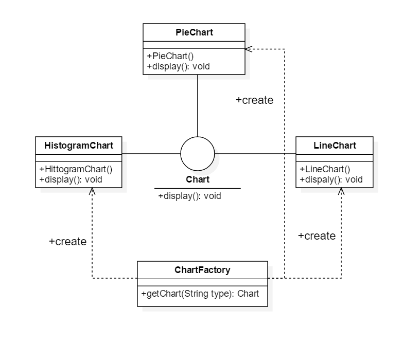

# 简单工厂模式实现

## 1. 定义

简单工厂模式（Simple Factory Pattern-静态工程模式）: 定义一个工厂类，它可以根据不同的参数返回不同类的实例，被创建的实例 通常具有共同的父类

## 2. 解析

简单工厂模式种的创建实例的方法通常是静态（static）方法，因此简单工厂模式又被成为静态工厂模式，他是一种创建型模式。简单工厂模式
的要点在于当用户需要什么时，只需要传入一个正确的参数就可以获取所需要的对象，而无须知道其创建细节（可以参考SimpleFactoryPrinciple包下的类）  


1. Factory(工厂角色)：工厂角色即工厂类，它是简单工厂模式的核心，负责实现创建所有产品实例的内部逻辑；工厂类可以被外界直接调用， 创建所需的产品对象；在工厂类种提供了静态工工厂方法factoryMethod()
   ，它的返回类型为抽象产品类型Product
2. Product(抽象产品角色)：他是工厂类创建的所有对象的父类，封装了各种产品对象的公共方法，它的引入将提高系统的灵活性，使得在工厂类中 只需要定义一个通用的工厂方法，因为所有创建的具体产品对象都是其子类对象
3. ConcreteProduct(具体产品角色)：它是简单工厂模式的创建目标，所有被创建的对象都充当这个角色的某个具体类的实例。每一个具体产品角色都继承了抽象产品角色， 需要实现在抽象产品中声明的抽象方法

## 3. 关于创建对象与使用对象

1. 使用new关键字直接创建对象
2. 通过反射机制创建对象（工厂方法模式将会介绍）
3. 通过克隆方法创建对象（深浅克隆模式将会介绍）
4. 通过工厂类创建对象  
   new毫无疑问是最简单的一种创建对象的方式，但是灵活性较差,比如:

```
 public class Simple {
        private A a;

        public Simplae() {
            a = new A(); //创建对象
        }

        public void execute() {
            a.methond(); // 使用对象
        }
    }
```

以上代码会导致如果想使用A的子类的时候就必须去修改构造方法中的源码，但是这样会破坏***开闭原则*** ，所以需要引入工厂类进行分离

## 4. 工厂类

工厂类的引入可以降低产品或工厂类改变所造成的维护工作量，工厂类的最大的作用就是将对象的创建和使用分离，使用系统更加符合***单一原则***，
有利于对功能的复用和系统的维护。此外，将对象的创建和使用分离还有一个好处：防止用来实例化一个类的数据和代码在多个类中到处都是，可以将有关创建的知识搬移到下一个工厂类中。因为有时候创建一个对象不只是简单地调用其构造函数，还需要设置一些参数，可能还需要配置环境，如果将这代码散落在每一个创建对象的客户类中，势必会出现代码重复，创建蔓延的问题，而这些客户类
其实武学承担对象的创建工作，他们只需要使用自己所创建好的对象就可以了，此时可以引入工厂类来封装对象的倡建逻辑和客户代码实例化配置选项

## 5. 工厂类的设计

一个系统中并不是需要为每一个类都配备一个工厂类，如果一个类简单则不存在太多变划，其构造过程也很简单，此时就无需为其提供工厂类，直接使用之前实例化即可。例如Java语言中的String类
，就无须为它专门提供一个StringFactory，这样做反而会导致工厂泛滥，增加系统的复杂度
> 所有的工厂模式都需遵守一点：两个类A与B之间的关系应该仅仅是A创建B或者A使用B，而不能两种关系都有

## 6. 简单工厂模式的简化

  
根据参数的不同创建不同的字类对象

## 7. 简单工厂模式优缺点与使用环境

### 7.1 简单工厂模式优点

1. 工厂类包含必要的判断逻辑，可以决定在什么时候创建哪一个产品类的实例，客户端可以免除直接创建产品对象的职责，而仅仅“消费”产品， 简单工厂模式实现了对象创建和分离
2. 客户端无须知道具体产品类的类名，只需要知道具体产品类所对应的参数即可，对于一些复杂的类名，通过简单工厂模式可以在一定的程度上减少使用者的记忆量
3. 通过引入配置文件，可以在不修改任何客户端代码的情况下更换和增加新的的具体产品类，在一定程度上提高了系统的灵活性

### 7.2 简单工厂模式缺点

1. 由于工厂类集中了所有产品的创建逻辑，职责过重，一旦不能正常工作，整个系统都受到影响
2. 使用简单工厂模式势必会增加系统类的个数（引入了薪得工厂类），增加了系统的复杂度和理解难度
3. 系统扩展困难，一旦添加新产品就不得不修改工厂逻辑，在产品类型较多时有可能造成工厂逻辑过于复杂，不利于系统的扩展和维护
4. 简单工厂模式由于使用了静态工厂方法，造成工厂角色无法星成基于继承的等级结构

### 7.3 简单工厂模式使用环境

1. 工厂类负责创建的对象比较少，由于创建的对象比较少，不会造成工厂方法中的业务逻辑过于复杂
2. 客户端只知道传入工厂类的参数，对于如何创建对象并不关心

## 8. 简单工厂模式例题

> 例题：某软件公司要基于Java语言开发一套图库表，该图库表可以为应用系统提供多种不同外观的图表，例如柱状图（HistogramChart）、饼状图（PieChart）、折线图（LineChart）等。该软件公司图表设计人员希望为应用系统开发人员提供一套灵活易用的图标库，通过设置 不同的参数即可得到不同类型的图表，而且可以较为方便地对图标库进行扩展，以便能够在将来增加一些新类型的图表，采用简单工厂模式
>
类图:  



