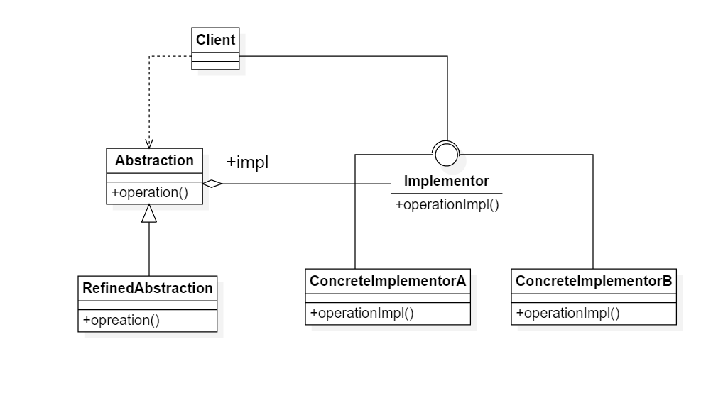
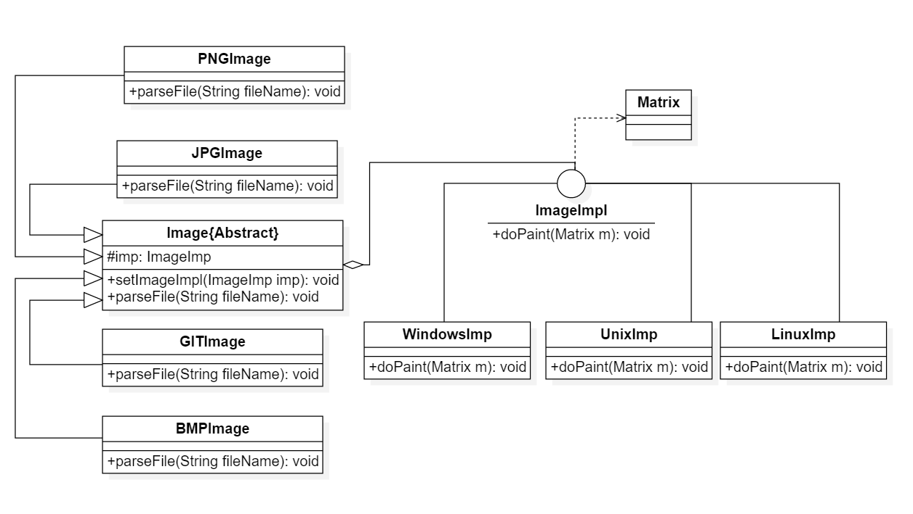

# 桥接模式

## 1. 桥接模式(Bridge Pattern)

### 1.1 定义

桥接模式：将抽象部分与它的实现部分解耦，使得两者都能独立变化

### 1.2 解析

1. 桥接模式是一种对象结构型模式，它又被成为柄体(Handle and Body)模式或接口(Interface)模式
2. 桥接模式用一种巧妙的方式处理多层继承存在的问题，用抽象关联取代了传统的多层继承，将类之间的静态继承关系转换为动态的对象组合关系，使得系统更加灵活，并易于扩展，同时有效地控制了系统中类的个数

### 1.3 类图

1. Abstraction(抽象类)：它是用于定义抽象类的接口，通常是抽象类而不是接口，其中定义了一个Implementor(实现类接口)
   类型的对象并可以维护该对象，它与Implementor之间具有关联关系，它既可以包含抽象业务方法，也可以包含具体业务方法
2. RefinedAbstraction(扩充抽象类)
   ：它扩充由Abstraction定义的接口，通常情况下它不再是抽象类而是具体类，实现了在Abstraction声明的抽象业务方法，在RefinedAbstraction中可以调用在Implementor中定义的业务方法
3. Implementor(实现类接口)
   ：它是定义实现类的接口，找个接口不一定要与Abstraction的接口完全一致，事实上这两个接口可以完全不同。一般而言，Implementor接口仅提供基本操作，而Abstraction定义的接口可能会做更多更复杂的操作。Implementor接口
   对这些基本操作进行了声明，而具体实现交给其子类。通过关联关系，在Abstraction中不仅拥有自己的方法，还可以调用到Implementor中定义的方法，使用关联关系来替代继承关系
4. ConcreteImplementor：它具体实现了Implementor接口，在不同的ConcreteImplementor中提供基本操作的不同实现，在程序运行时ConcreteImplementor对象替换父类对象，提供给抽象类具体的业务操作方法

## 2. 桥接模式的例子

> 某软件公司要开发一个跨平台图像浏览系统，要求该系统能够显示BMP，JPG，GIG,PNG等多种格式的文件，并且能够在Windows，Linux，UNIX等多个操作系统上运行。系统首先将各种格式的文件解析为像素矩阵(Matrix)，然后将像素矩阵显示在屏幕上，在不同的
> 操作系统中可以调用不同的绘制函数来绘制像素矩阵。系统需具有较好的扩展性，以便将来支持新的文件格式和操作系统

类图：

## 3. 桥接模式与适配器模式的联用

桥接模式和适配器模式是用于设计的不同阶段，桥接模式用于系统的初步设计，对于存在两个独立变化维度的类可以将其分为抽象化和实现化两个角色，使它们可以分别进行变化；而在初步设计完成之后，当发现系统与已有类无法系统工作时可以采用适配器模式。所以在设计阶段的时候要考虑到大量等第三方应用接口的情况

## 4. 桥接模式的优缺点

### 4.1 优点

1. 分离抽象接口极其实现部分。桥接模式使用”对象间的关联关系“解耦了抽象和实现之间固有的绑定关系，也就是说抽象和实现可以沿着各自的维度来变化。所谓抽象和实现沿着各自维度的变化也就是说抽象和实现不在同一个继承层次结构中，而是”子类化“他们，使它们各自具有自己的子类，以便任何组合子类，从而获得多维度组合对象
2. 在很多情况下，桥接模式可以取代多呈继承方案，多层继承方案违背了单一职责，复用性较差，并且类的个数非常多，桥接模式是比多层继承方案更好的解决方案的解决方法，它极大地减少了子类的个数
3. 桥接模式提高了系统的可扩展性，在两个变化维度中任意扩展一个维度都不需要修改原有系统，符合开闭原则

### 4.2 缺点

1. 桥接模式的使用会增加系统的理解和设计难度，由于关联关系建立在抽象层，要求开发者一开始就针对抽象层进行设计与编程
2. 桥接模式要求正确地识别出系统中两个独立变化的维度，因此其使用范围具有一定的局限性，如何正确分别两个独立维度也需要一定的经验积累

## 5. 桥接模式的适用环境

1. 如果一个系统需要在抽象化和具体化之间增加更多的灵活性，避免在在两个层次之间建立的继承关系，通过桥接模式可以使它们在抽象层建立一个关联关系
2. 抽象部分和实现部分可以继承的方式独立扩展而互不影响，在程序运行时可以动态地将一个抽象化子类的对象和一个实现子类化的对象进行组合，即系统需要对抽象化角色和实现化角色进行动态解耦
3. 一个类存在两个(或多个)独立变化的维度，且这两个(或多个)维度都需要独立进行扩展
4. 对于那些不希望使用或因为多层继承导致系统类的个数急剧增加的系统，桥接模式尤为适用