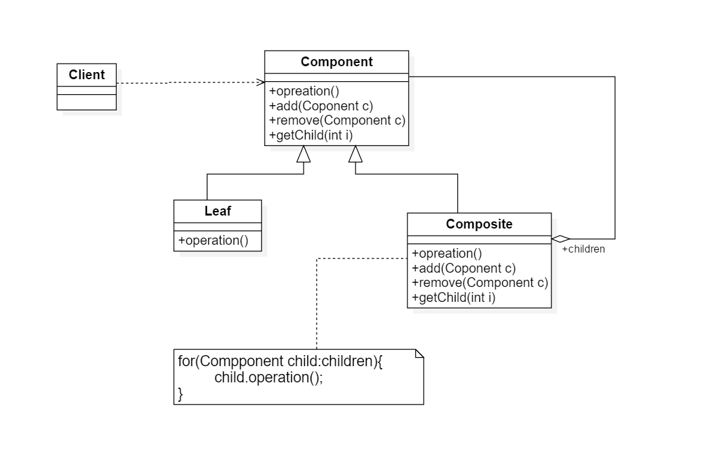
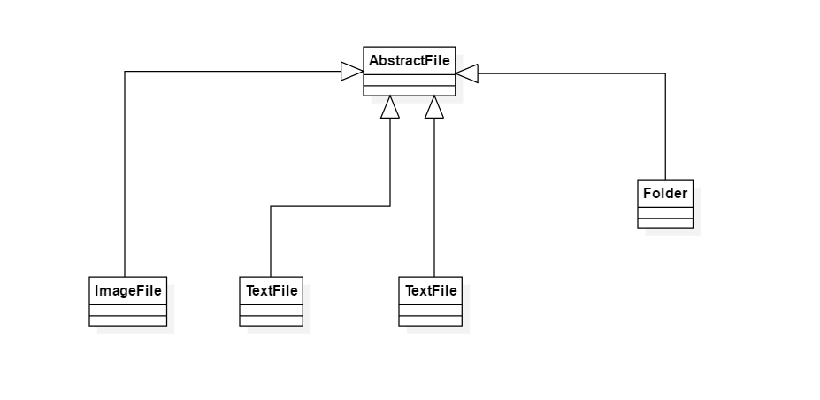

# 组合模式

## 1.定义

组合模式：组合多个对象形成树形结构以表示具有部分-整体关系的层次结构。组合模式让客户端可以统一对待单个对象和组合对象（属于对象结构性模式）

## 2.类图

1. Component(抽象组件)：它可以是接口或抽象类，为叶子构件和容器构件对象声明接口，在该角色中可以包含所有子类共同行为的声明和实现。在抽象构件中定义了访问及管理它的子构件的方法，如增加，删除，获取子构件等
2. Leaf（叶子构件）：它在组合结构这种表示叶子结点对象，叶子结点没有子结点，它实现了在抽象构件中定义的行为。对于那些访问及管理子构件的方法，可以通过抛出异常，提示错误等方式进行处理
3. Composite（容器构件）：它在组合结构中表示容器结点对象，容器结点包含子结点

## 3.例子

某软件要开发一个杀毒软件，该软件可以对某个文件夹杀毒，也可以对某个指定的文件杀毒。该杀毒软件可以根据各类文件的特点为不同类型的文件提供不同的杀毒方式，例如图像文件和文本文件的杀毒方式就有所差异

### 3.1 类图

## 4.组合模式的JDK例子

JaveSE中的AWT和Swing包的设计就基于组合模式

## 5.组合模式的优点

1. 可以清楚地定义分层的复杂对象，表示对象的全部或部分层次，它让客户端忽略了层次的差异，方便对整个层次结构进行控制
2. 客户端可以一致地使用一个组合结构或其中单个对象，不必关心单个对象还是整个组合结构，简化了客户端代码
3. 在组合模式中增加新的容器构件和叶子构件都很方便，无须对现有类库进行任何修改，符合开闭原则
4. 为树形结构地面向对象实现提供了一种灵活的解决方案，通过叶子对象和容器对象的递归组合可以形成复杂的树形结构

### 5.1 组合模式的缺点

在增加新的构件时很难对容器中的构件类型进行限制，有时候希望一个容器中只能有某些特定类型的对象，例如在某个文件夹中只能包含文本文件，
在使用组合模式时不能依赖类型系统来施加这些约束，因为它们都来自于相同的抽象层，在这种情况下必须通过在运行时进行类型检查来实现，这个实现过程较负责

### 5.2 组合模式的试用环境

1. 在整体和部分层次结构中希望通过一种方式忽略整体与部分的差异，客户端可以一致地对待它们
2. 一个使用面向对象语言开发的系统中需要一个树形结构
3. 在一个系统中能够分离出子叶对象和容器对象，而且它们的类型不固定，需要增加一些新的类型

