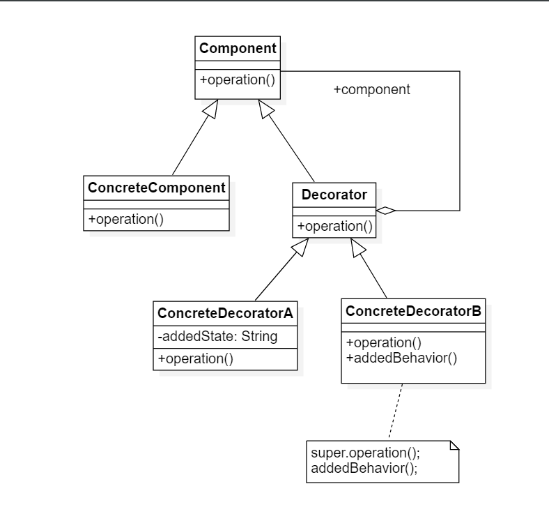
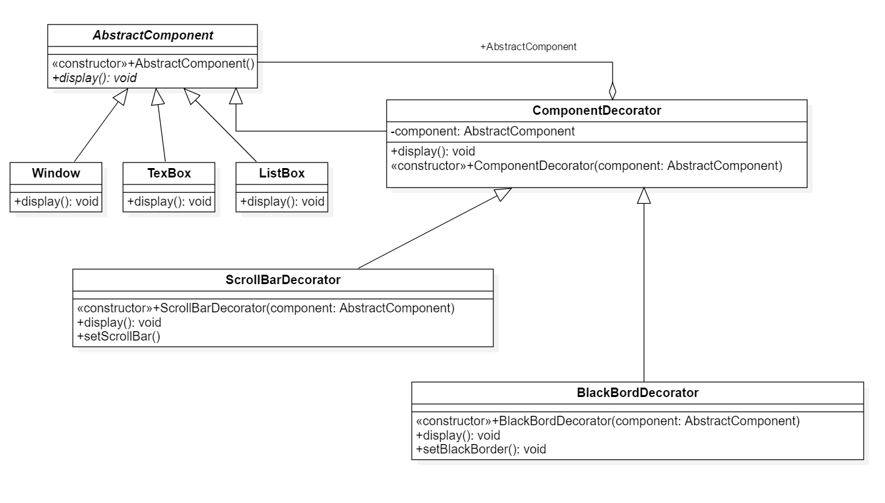

# 装饰模式

## 1.定义

装饰模式：装饰模式是一种用于提代子类的继承的技术，它通过一种无须定义子类的方式来给对象动态增加职责，使用对象之间的关联关系取代类之间的继承关系。换而言之， 就是动态地给一个对象增加一些额外的职责。

## 2.类图



1. Component抽象构件：它是具体构件和抽象装饰类的共同父类，声明了在具体的构件中实现的业务方法，它的引入可以使客户端以一致的方式处理未被装饰的对象以及装饰之后的对象，实现客户端的操作
2. ConcreteComponent具体构件：它是抽象构建类的子类，用于定于具体构件对象，实现了在抽象构件中声明的方法，装饰类可以给它增加额外的职责(方法)
3. Decorator抽象装饰类：它也是抽象构件类的子类，用于具体构件增加职责，但是具体指责在其子类中实现，它维护一个指向抽象构件对象的引用，通过该引用可以调用装饰之前构建对象的方法，并通过其子类扩展该方法，以达到装饰的目的
4. ConcreteDecorator具体装饰类：它是抽象装饰类的子类，负责向构件添加新的职责。每一个具体装饰类都定义了一些新的行为，它可以调用在抽象装饰类中的定义的方法，并可以增加新的方法用于扩充对象的行为

## 3.例子

> > 某软件公司基于面向对象技术开发了一套图形界面构件库VisualComponent，该构件库提供了大量的基本构件，如窗体、文本框、列表框等，由于在使用该构件库时用户经常要求定制一些特殊的显示效果，如带滚动条的窗体，带黑色边框的文本框，既带滚动条又带黑色边框的列表框等，因此经常需要对该构件库进行扩展以增强其功能

### 3.1 类图



## 4.透明装饰模式和半透明装饰模式

在装饰模式中，具体装饰类通过新增变量或者成员方法来扩充具体构件类的功能。在标准的装饰模式中，新增行为需在原有的业务方法中调用，无论是具体构件对象还是装饰过的构件对象，对于客户端而言都是透明的，这种装饰模式被称为透明(Transparent)
装饰模式。 但是在某些情况下，有些新增行为可能需要被单独调用，此时客户端不能再一致性地处理装饰之前的对象和装饰之后的对象，这种装饰模式被成为半透明(Semi-transparent)装饰模式

```
Component componentSb; //使用抽象构件定义声明 --- 透明装饰模式
---无法调用addedBehavior()方法

ComponentDecorator componentSb; //使用具体装饰类型定义 --- 半透明装饰模式 
--- componentSb.addedBehavior单独调用新增业务方法
```

## 5.装饰模式优缺点与试用环境

### 5.1 装饰模式优点

1. 对于扩展一个对象的功能，装饰模式比继承更加灵活，不会导致类的个数急剧增加
2. 可以通过一种动态的方式扩展一个对象的功能，通过配置文件可以在运行时选择不同的具体装饰类，从而实现不同的行为
3. 可以对一个对象进行多次装饰，通过使用不同的具体装饰类以及这些装饰类的排列组合可以创造出很多不同行为的组合，得到功能更强大的对象
4. 具体构件类与具体装饰类可以独立变化，用户可以根据需要增加新的具体构件类和具体装饰类，原有库代码无须改变，符合开闭原则

### 5.2 装饰模式缺点

1. 在使用装饰模式进行系统设计时产生很多小对象，这些对象的区别在于它们之间互相连接的方式有所不同，而不是它们的类或者属性值有所不同，大量小对象的产生势必会占用更多的系统资源，在一定的程度上影响程序的性能
2. 装饰模式提供了一种比继承更加灵活，机动的解决方案，但同时也意味着比继承更加易于出错，排错也更困难，对于多次装饰的对象，在调试的时寻找错误可能需要逐级排查，较为繁琐

### 5.3 装饰模式试用环境

1. 在不影响其他对象的情况下以动态、透明的方式给单个对象添加职责
2. 当不能采用继承的方式对系统进行扩展或者继承不利于系统扩展和维护时可以使用装饰模式。不能通过继承的情况有两类：第一类是系统存在大量的独立扩展，为支持每一种扩展或者扩展之间的组合将产生大量的子类，使得子类数目呈爆炸性增长；第二类是因为类已定义为不能被继承(final关键字)