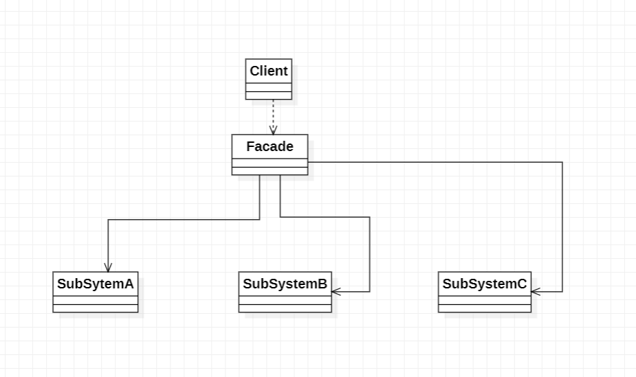
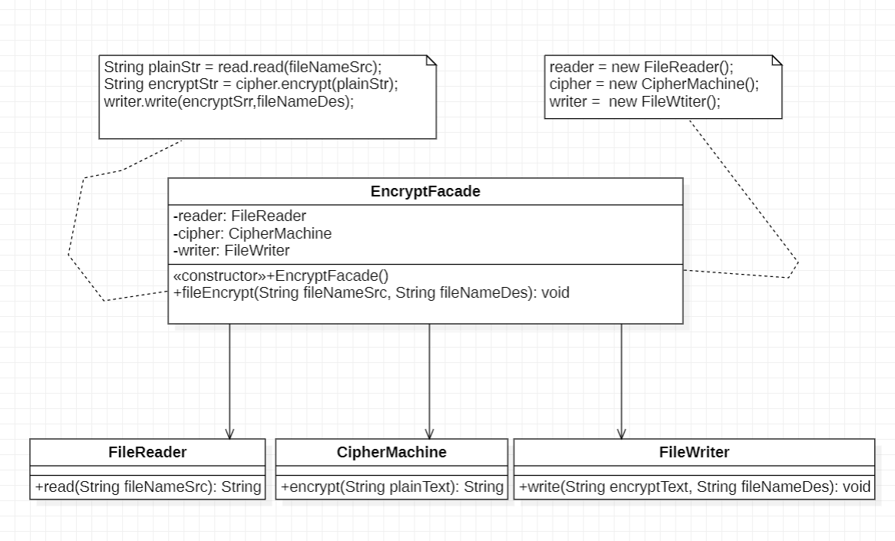
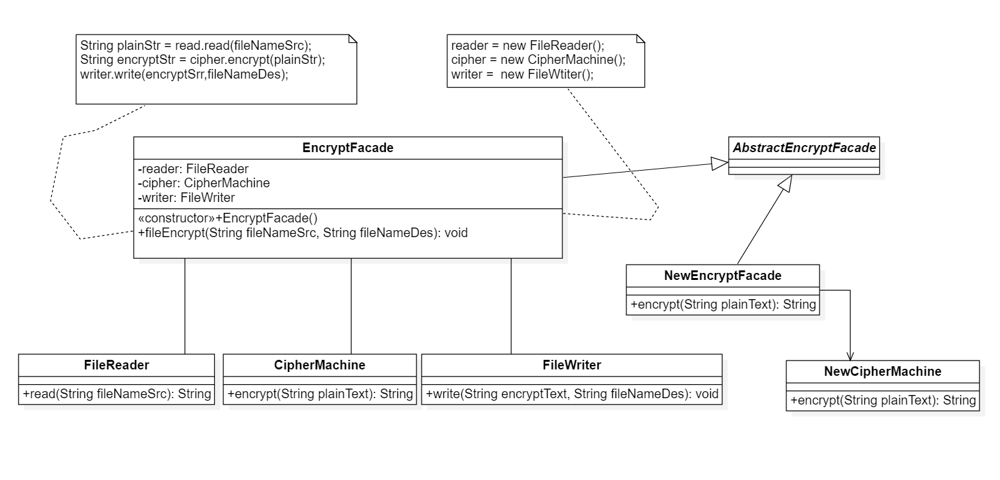

# 外观模式

## 1.定义

外观模式：外观模式是一种使用频率较高的结构型设计模式，它通过引入一个外观角色来简化客户端与子系统之间的交互，为复杂的子系统调用提供一个统一的入口。 外观模式定义了一个高层接口，这个接口使得这一个子子系统更加容易使用。

## 2.类图

1. Facade(外观角色)：在客户端可以调用它的方法，在外观角色中可以知道相关的子系统的功能和责任；在正常情况下，它将所有从客户端发来的请求委派到相应的子系统，传递给相应的子系统对象处理
2. SubSystem(子系统角色)：在软件系统中可以有一个或多个子系统角色，每一个系统可以不是一个单独的类，而是一个类的集合，它可以实现子系统的功能，每一个子系统都可以被客户端或者外观角色。

## 3.例子

> > 某软件公司要开发一个可应用于多个软件的文件加密模块，该模块可以对文件中的数据进行加密之后的数据存储在一个新文件中，具体的流程包括三个部分，分别是读取源文件，加密，保存加密之后的源文件。其中读取文件和保存文件使用流来实现，加密操作通过求模运算实现。这三个操作相对独立，为了实现代码的独立重用，让设计模式更符合单一原则，这三个操作的业务代码封装在三个不同的类中。

### 3.1 类图

## 4.抽象外观类

### 4.1 抽象外观类类图

如今的时代需求过于复杂和变态，相对来说如今这种方式会极大的增加类的个数，若是存在多个策略实现类类，可通过策略模式指定即可，由客户端传入对应的子系统Key，类似搜索框选择。

## 5.外观模式的优缺点与适用环境

外观模式是一种使用频率较高的设计模式，它通过引入一个外观角色来简化客户端与子类之间的交互，为复杂的子系统调用提供一个统一的入口，使子系统与客户端的耦合降低，且客户端调用非常方便。
外观模式并不给系统增加任何性功能，它仅仅是简化调用首页或者导航页面，大部分C/S系统都提供了菜单和工具栏，在首页和导航就是B/S的外观角色。通过它们客户可以快速访问子系统。JavaEE中的Session就使用了外观模式

### 5.1 外观模式的优点

1. 对客户端屏蔽了子系统组件
2. 实现了子系统与客户端的解耦
3. 一个子系统的修改对其它子系统没有任何影响，而且子系统内部的变化也不会影响到外观对象

### 5.2 外观模式的缺点

1. 不能很好的限制客户端直接使用子系统类，如果对客户端访问子系统类做太多的限制则减少了可变性和灵活性
2. 如果设计不当，增加新的子系统可能需要修改外观类的源码，违背了开闭原则

### 5.3 外观模式的试用环境

1. 当需要为访问一系列复杂的子系统提供一个简单入口时可以使用外观模式
2. 客户端程序与多个子系统之间存在很大的依赖性。引入外观类可以将子系统与客户端解耦，从而提供子系统的独立性和可移植性
3. 在层次化结构中可以使用外观模式定义系统中每一层的入口，层与层之间不直接产生关系，而通过外观类建立联系，降低层之间的耦合度
