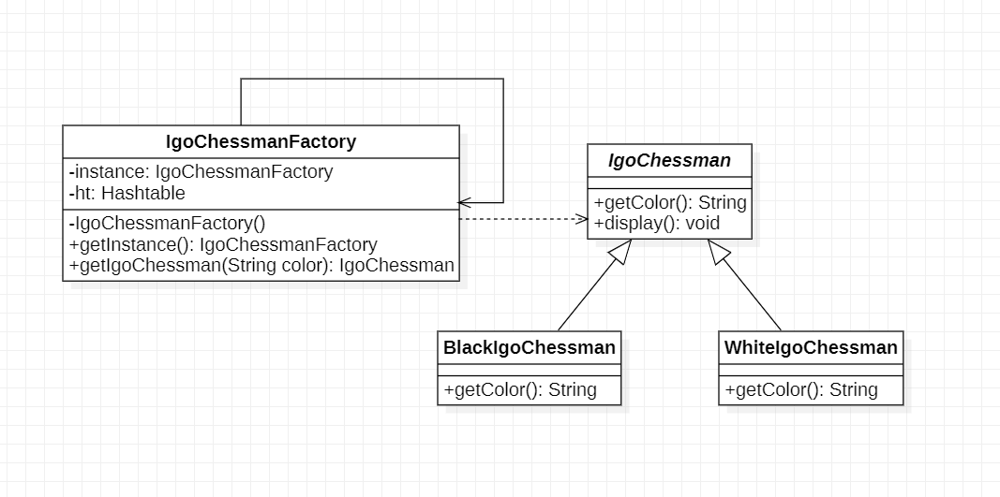

# 享元模式

## 1.定义

享元模式：运用共享技术有效地支持大量细粒度对象的复用

## 2.类图

1. Flyweight(抽象享元类)：抽象享元类通常是一个接口或抽象类，在抽象享元类中声明了具体享元类的公共方法，这些方法可以向外界提供享元对象的内部数据（内部状态），同时也可以通过这些方法来设置外部数据（外部状态）
2. ConcreteFlyweight(具体享元类)：具体享元类实现了抽象享元类，其实例成为享元对象；在具体享元类中为内部状态提供了存储空间。通常可以结合单例模式来设计具体享元类，为每一个具体享元类提供唯一的享元对象
3. UnsharedConcreteFlyweight(非享元具体享元类)：并不是所有的抽享元类的子类都需要被共享，不能被共享的子类可设计为非共享具享元类；当需要一个非共享具体享元类的对象时可以实例化创建
4. FlyweightFactory(享元工厂类)：享元工厂类用于创建并管理享元对象，它针对抽象享元类编程，将各种类型的具体享元对象存储在一个享元池中，享元池一般设计为一个存"键值对"
   的集合（也可是其它类型的集合），可以结合工厂模式进行设计；当用户请求一个具体享元对象时，享元工厂提供一个存储在享元池中已创建的实例或者创建一个新的实例（如果不存在），返回新创建的实例并且将其存储在享元池中

## 3.例子

> > 该软件公司的开发人员通过对围棋软件进行分析发现，在围棋棋盘中包含大量的黑子和白子，它们的形状，大小一摸一样，只是出现的位置不同而已。如果将每一个棋子作为一个独立的对象存储在内存中，将导致该围棋软件在运行时所需的内存空间较大，那么如何降低运行代价，提高系统性能是需要解决的一个问题。为了解决该问题，现使用享元模式来设计该围棋软件的棋子对象

### 3.1 类图

## 3.2 有外部状态的享元模式

## 3.3 外部状态的类图

## 4.单纯享元模式和复合享元模式

### 4.1 单纯享元模式

在单纯享元模式中所有的具体享元类都是可以共享的，不存在非共享具体享元类

### 4.2 复合享元模式

使用对象组合设计模式加以组合还可以形成复合享元对象

## 5.享元模式缺点/缺点/适用环境

### 5.1 享元模式优点

1. 享元模式可以减少内存中对象的数量，使得相同或者相似对象在内存中只保存一份，从而可以节约系统资源，提供系统性能
2. 享元模式的外部状态相对独立，而且不会影响其内部状态，从而使得享元对象可以在不同的环境中被共享

### 5.2 享元模式缺点

1. 享元模式使系统变得复杂，需要分离出内部状态和外部状态，这使得程序的逻辑复杂化
2. 为了使对象可以共享，享元模式需要将享元对象的部分状态外部化，而读取外部状态将是运行时间变长

### 5.3 享元模式适用环境

1. 一个系统有大量相同或相似的对象，造成内存的大量浪费
2. 对象的大部分状态都可以外部化，可以将这些外部状态传入对象中
3. 在适用享元模式时需要维护一个存储享元对象的享元池，而这需要耗费一定的系统资源，因此应当在需要多次重复使用享元对象时才使用享元模式