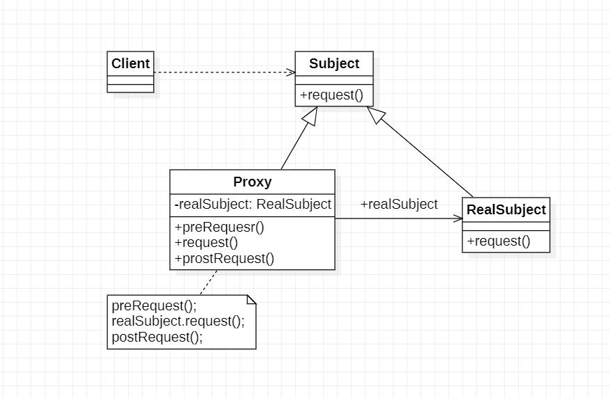
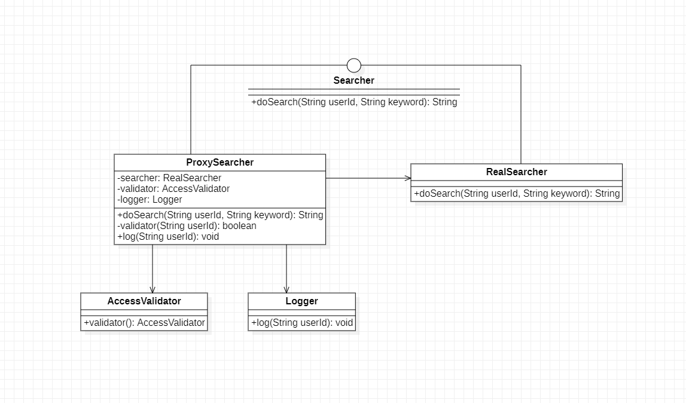

# 代理模式

## 1.定义

代理模式：给某一个对象提供一个代理或占位符，并由代理对象来控制原对象的访问

## 2.类图

1. Subject(抽象主题角色)：它声明了真实主题和代理主题的公共接口，这样一来在任何使用真实主题的地方都可以使用代理主题，客户端通常需要针对抽象主题角色进行编程
2. Proxy(代理主题角色)：它包含了对真实主题的引用，从而可以在任何时候操作真实主题对象；在代理角色中提供了一个与真实主题角色的相同接口，以便在任何时候都可以替代真实主题；代理主题角色还可以控制对真实主题的使用，负责在需要的时候创建和删除真实主题对象，并对真实对象的使用加以约束。通常，在代理主题角色中客户端在调用所引用的真实主题操作之前或之后还需要执行其他操作，而不仅仅是单纯调用其真实主题对象中的操作。
3. RealSubject(真实主题角色)：它定义了代理角色所代表的真实对象，在真实主题角色中实现了真实的业务操作，客户端可以通过代理主题角色间接调用真实主题角色中定义的操作

## 3.分类

1. 远程代理(Remote Proxy)：为一个位于不同地址空间的对象提供一个本地的代理对象，这个不同的地址空间可以在同一台主机中，也可以在另一台主机中，远程代理又称为大使(Ambassador)
2. 虚拟代理(Virtual Proxy)：如果需要创建一个资源消耗较大的对象，先创建一个消耗较小的对象来表示，真实对象只在需要时才会被真正创建
3. 保护代理(Protect Proxy)：控制对一个对象的访问，可以给不同的用户提供不同级别的使用权限
4. 缓冲代理(Cache Proxy)：为某一个目标操作的结果提供临时的存储空间，以便多个客户端可以共享这些结果
5. 智能引用代理(Smart Reference Proxy)；当一个对象被引用时提供一些额外的操作，例如讲被调用的次数记录下来

## 4.代理模式应用示例

>> 某软件公司承接了某信息咨询公司得收费商务信息查询系统的开发任务，该系统的基本需求如下：
1. 在进行商务信息查询之前用户需要通过身份验证，只有合法用户才能够使用该查询系统
2. 在进行商务信息查询时系统需要记录查询日志，以边根据查询次数收费查询费用

该软件公司的开发人员已完成了商务信息查询模块开发任务，现希望能够以一种松耦合的方式向原有系统增加身份验证和日记记录功能，客户端代码可以无区别地对待原始的
商务信息模块和增加新功能之后的商务信息查询模块，而且可能在将来还要在该信息查询模块中增加一些新功能，使用代理模式进行设计并实现

