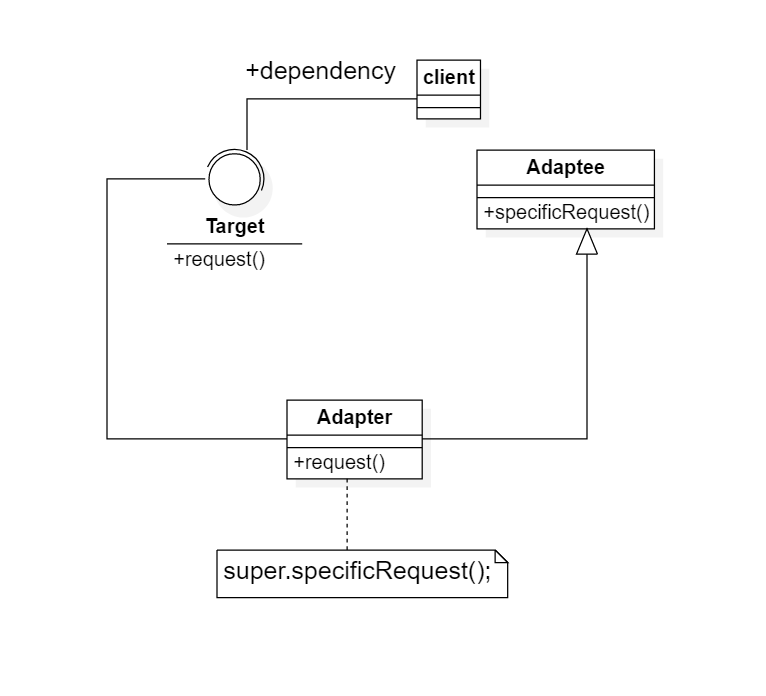
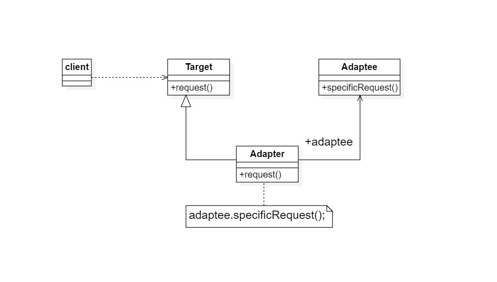
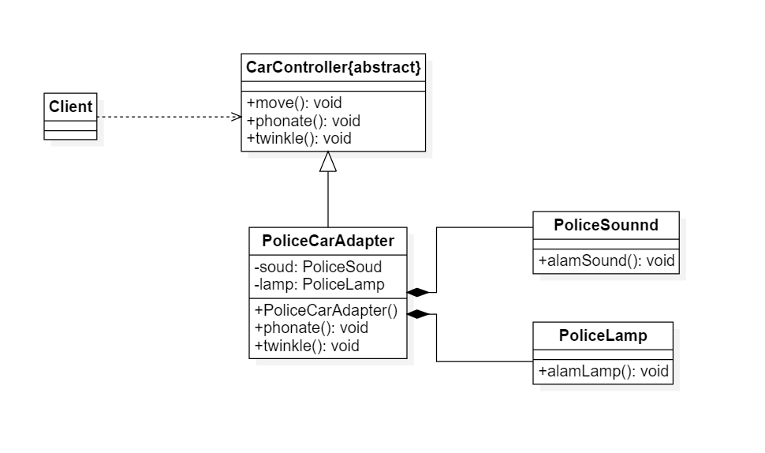
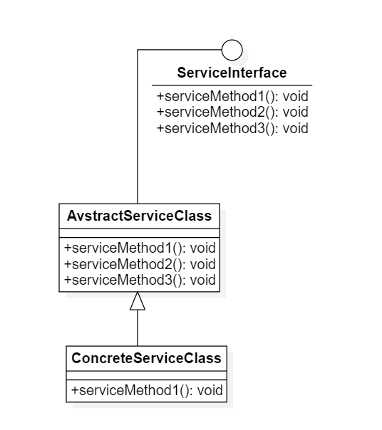
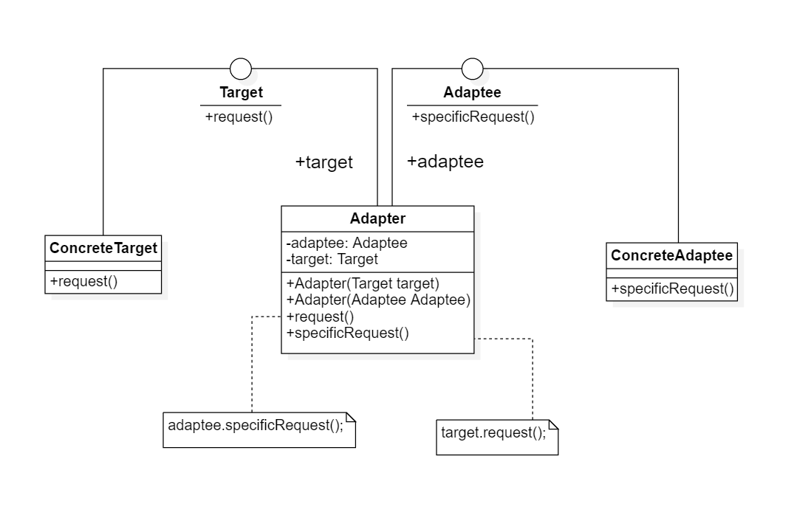

# 适配器模式

## 1. 结构型模式

### 1.1 结构型描述

1. 结构性型模式(Structural Pattern)关注如何将现有类或对象组织在一起形成更加强大的结构
2. 结构型模式可以描述两种不同的东西---类与类的实例(即对象)，根据这一点，结构型模式可以分为类结构模式和对象结构模式。
3. 类的结构型模式关心类的组合，由多个类可以组合成一个更强大的系统，在类结构型模式种一般只存在继承关系和实现关系;而对象结构型模式关心类与对象的组合，通过关联关系在一个类中定义另一个类的实例对象，然后通过该对象调用响应的方法
4. 根据组合复用原则，在系统种 尽量使用关联关系来提替代继承关系，因此大部分结构型模式都是对象结构型模式

## 2. 适配器模式

### 2.1 含义

适配器模式(Adapter Pattern，包装器(Wrapper)模式)：将一个类的接口转换成客户希望的另一个接口，适配器模式让那些接口不兼容的类可以一起工作

### 2.2 结构与实现

类适配器模式类图:

对象适配器模式类图:

1. Target(目标抽象类)：目标抽象类定义客户所需的接口，可以是一个抽象类或接口，也可以是具体类。在类的适配中，由于Java语言不支持多重继承，它只能是接口
2. Adapter(适配器类)：它可以调用另一个接口，作为一个转换器，对Adaptee和Target进行适配。适配器Adapter是适配器模式的核心，在类
   适配器中，它通过实现Target接口并继承Adaptee类来使二者产生联系，在对象适配器中，它通过继承Target并关联一个Adaptee对象使二者产生联系
3. Adaptee(适配者类)：适配者即被适配的角色，它定义了一个已经存在的接口，这个接口需要适配，适配者类一般是一个具体类，包含了客户希望使用的业务方法，在某些情况下甚至没有适配者类的源码

类适配器强调的是与适配者是继承关系，而对象适配器模式强调的是与适配者是关联关系。适配器模式更多的强调代码的组织，而不是功能的实现

## 3. 适配器模式例子

> 某公司要开发一款儿童玩具车汽车，为了更好地吸引小朋友的注意力，该玩具汽车在以动过程中伴随着灯光闪烁和声音提示，在该公司以往的产品中已经实现了控制灯光闪烁和声音提示，例如警车

类图：  

本实例中的目标抽象类是一个抽象类，而不是接口，并且实例中的适配器类PoliceCarAdapter同时适配了两个适配者，由于Java不支持多重继承，所以只能通过对象适配器模式来实现，在实际软件开发中对象适配器比类适配器更加灵活，其使用频率更高

## 4. 缺省适配器模式

缺省适配器(Default Adapter Pattern)：当不需要 一个接口提供的所有方法时，可以先设计一个抽象类实现该接口，并为接口中的每一个方法提供一个默认方法(空方法)
,那么该抽象类的子类可以选择性覆盖父类的某些方法来实现需求，它适用于不想一个接口中所有方法的情况，又称为单接口适配器模式

缺省适配器模式的类图：  

1. ServiceInterface(适配者接口)：它是一个接口，通常在该接口中声明了大量的方法
2. AbstractServiceClass(缺省适配器类)：它是缺省适配器模式的核心类，使用空方法实现了在ServiceInterface接口中声明的方法。通常将它定义为抽象类，因为对它进行实例化没有任何意义
3. ConcreteServiceClass(具体业务类)
   ：它是缺省适配器类的子类，在没有引入适配器之前它需要实现适配者接口，因此需要实现在适配者接口中定义的所有方法，而对于一些无须使用的方法不得不提供空实现。在有了缺省适配器之后可以直接继承该适配器类，根据需要有选择性地覆盖在适配器类中定义地方法

## 5. 双向适配器

在对象适配器使用过程中，如果在适配器中时包含对目标类和适配者类的引用，适配者可以通过它调用目标类的方法，目标类也可以通过它调用适配者类中的方法，这就是双向适配器

双向适配器的类图：

## 6. 适配器模式的优缺点与适用环境

### 6.1 优点

无论是对象适配器模式还是类适配器模式都具有以下优点：

1. 将目标类与适配者类解耦，通过引入一个适配器类重复现有的适配者类，无须修改原结构
2. 增加类的透明性与复用性，将具体的业务实现过程封装在适配者类中，对于客户端类而言是透明的，而且提高了适配者的复用性，同一个适配者类可以在多个不同的系统中复用
3. 灵活性和扩展性都非常好，通过适用配置文件可以很方便地更换适配器，也可以在不修改原有代码地基础上增加新的适配器类，完全符合开闭原则

类适配器模式的独有的优点：由于适配器类是适配者的子类，因此可以在适配器类中置换一些适配者的方法，使得适配器的灵活性更强

对象适配器模式的独有优点：一个对象可以适配多个不同的适配者，也可以适配一个适配者的子类

### 6.2 缺点

类适配器模式:

1. 不支持多重类继承的语言，一次最多只能适配一个适配者，而且目标抽象类也必须为接口，具有一定的局限性
2. 适配者类不成为最终类，例如在Java中被申明为final类

对象适配器模式:
与类适配器模式相比，对象适配器模式要在适配器中置换适配者类的某些方法比较麻烦，如果一定要置换掉适配者类的一个或多个方法，可以先做一个适配者的子类，将适配者类的方法置换掉，然后再把适配者的子类当成真正的适配者进行适配，实现过程比较复杂

### 6.3 适用环境

1. 系统需要使用一些现有的类，而这些类的接口(例如方法名)不符合系统的需要，甚至没有这些类的源代码
2. 想创建一个可以重复使用的类，用于和一些彼此之间没有太大关联的类(包括一些可能在将来引进的类)一起工作

